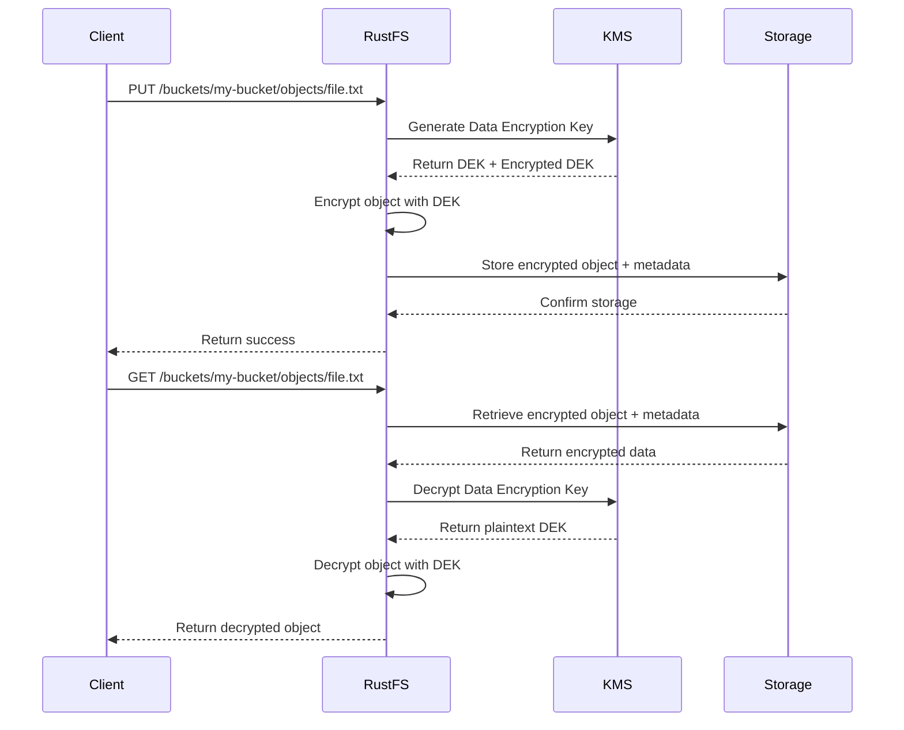

# RustFS Object Encryption

A comprehensive object encryption system for RustFS that provides transparent, secure, and high-performance encryption for stored objects.

## 🔐 Features

- **Multiple Encryption Algorithms**: Support for AES-256-GCM and ChaCha20-Poly1305
- **KMS Integration**: Seamless integration with Key Management Services (Local KMS, HashiCorp Vault)
- **Bucket-Level Configuration**: Per-bucket encryption policies and settings
- **Streaming Encryption**: Efficient encryption for large objects with minimal memory usage
- **Performance Optimizations**: Caching, parallel processing, and connection pooling
- **Comprehensive Monitoring**: Detailed metrics, audit logging, and performance tracking
- **Security Best Practices**: Secure key management, memory protection, and constant-time operations

## 🚀 Quick Start

### 1. Configure KMS

```toml
# config/kms.toml
[kms]
provider = "local"  # or "vault"
endpoint = "http://localhost:8200"
timeout_secs = 30
max_retries = 3
```

### 2. Enable Bucket Encryption

```bash
# Using REST API
curl -X PUT http://localhost:8080/api/v1/buckets/my-bucket/encryption \
  -H "Authorization: Bearer <token>" \
  -H "Content-Type: application/json" \
  -d '{
    "enabled": true,
    "algorithm": "AES256",
    "kms_key_id": "my-kms-key-id"
  }'
```

### 3. Upload Encrypted Objects

```bash
# Objects are automatically encrypted based on bucket configuration
curl -X PUT http://localhost:8080/api/v1/buckets/my-bucket/objects/secret.txt \
  -H "Authorization: Bearer <token>" \
  -H "Content-Type: text/plain" \
  --data-binary @secret.txt
```

### 4. Download and Decrypt

```bash
# Objects are automatically decrypted on download
curl -X GET http://localhost:8080/api/v1/buckets/my-bucket/objects/secret.txt \
  -H "Authorization: Bearer <token>" \
  -o decrypted-secret.txt
```

## 📁 Project Structure

```
rustfs/
├── crates/
│   ├── kms/                    # KMS integration and encryption services
│   │   ├── src/
│   │   │   ├── lib.rs          # Main library exports
│   │   │   ├── client/         # KMS client implementations
│   │   │   ├── crypto/         # Cryptographic operations
│   │   │   ├── types/          # Type definitions
│   │   │   ├── bucket/         # Bucket encryption management
│   │   │   ├── object/         # Object encryption service
│   │   │   ├── cache.rs        # KMS caching layer
│   │   │   ├── parallel.rs     # Parallel processing
│   │   │   └── monitoring.rs   # Monitoring and auditing
│   │   └── Cargo.toml
│   └── crypto/                 # Core cryptographic primitives
├── src/
│   ├── storage/
│   │   └── ecfs.rs            # ECFS storage with encryption integration
│   └── server/
│       └── handlers/
│           └── streaming.rs    # Streaming upload/download handlers
├── tests/
│   ├── integration_encryption_test.rs  # Integration tests
│   ├── security_encryption_test.rs     # Security tests
│   └── performance_encryption_test.rs  # Performance tests
└── docs/
    ├── object_encryption.md    # Comprehensive documentation
    └── encryption_api.md       # API reference
```

## 🔧 Architecture

### Core Components

1. **KMS Layer** (`crates/kms/`)
   - Abstract KMS interface
   - Local and Vault implementations
   - Key generation and management
   - Caching and performance optimization

2. **Encryption Service** (`crates/kms/src/object/`)
   - Object-level encryption/decryption
   - Multiple algorithm support
   - Streaming operations
   - Metadata management

3. **Storage Integration** (`src/storage/ecfs.rs`)
   - Transparent encryption in ECFS
   - Automatic encryption on PUT
   - Automatic decryption on GET
   - Metadata preservation

4. **API Layer** (`src/server/`)
   - REST API endpoints
   - Streaming handlers
   - Configuration management
   - Monitoring integration

### Encryption Flow



## 🛡️ Security Features

### Key Management
- **Envelope Encryption**: Each object encrypted with unique data key
- **KMS Integration**: Master keys managed by external KMS
- **Key Rotation**: Automatic support for key rotation
- **Access Control**: Fine-grained permissions for key usage

### Cryptographic Security
- **Strong Algorithms**: AES-256-GCM and ChaCha20-Poly1305
- **Authenticated Encryption**: Built-in integrity protection
- **Unique IVs/Nonces**: Cryptographically secure random generation
- **Constant-Time Operations**: Protection against timing attacks

### Memory Security
- **Secure Clearing**: Sensitive data cleared from memory
- **Protected Structures**: Use of `SecretVec` for key material
- **Minimal Exposure**: Keys only in memory when needed
- **Stack Protection**: Sensitive operations on secure stack

## ⚡ Performance Optimizations

### Caching
- **Data Key Caching**: Reduce KMS calls for frequently accessed keys
- **Configuration Caching**: Cache bucket encryption settings
- **TTL Management**: Automatic cache expiration and cleanup
- **Memory Efficient**: LRU eviction with configurable limits

### Parallel Processing
- **Concurrent Operations**: Parallel encryption/decryption
- **Chunked Processing**: Large objects processed in chunks
- **Worker Pools**: Configurable worker thread pools
- **Load Balancing**: Automatic work distribution

### Streaming
- **Memory Efficient**: Constant memory usage regardless of object size
- **Backpressure Handling**: Flow control for large uploads/downloads
- **Bandwidth Limiting**: Configurable rate limiting
- **Progress Tracking**: Real-time operation progress

## 📊 Monitoring and Observability

### Metrics
- **Operation Counts**: Encrypt/decrypt operation statistics
- **Performance Metrics**: Latency, throughput, and error rates
- **Cache Statistics**: Hit rates, eviction counts, memory usage
- **Resource Usage**: CPU, memory, and network utilization

### Audit Logging
- **Operation Logs**: Detailed logs of all encryption operations
- **Access Tracking**: User and application access patterns
- **Error Logging**: Comprehensive error reporting and analysis
- **Compliance**: Structured logs for regulatory compliance

### Health Checks
- **KMS Connectivity**: Monitor KMS service availability
- **Performance Thresholds**: Alert on performance degradation
- **Error Rate Monitoring**: Track and alert on error spikes
- **Resource Monitoring**: Monitor system resource usage

## 🧪 Testing

### Test Categories

1. **Unit Tests**
   ```bash
   cargo test --package rustfs-kms
   ```

2. **Integration Tests**
   ```bash
   cargo test --test integration_encryption_test
   ```

3. **Security Tests**
   ```bash
   cargo test --test security_encryption_test
   ```

4. **Performance Tests**
   ```bash
   cargo test --test performance_encryption_test --release
   ```

### Test Coverage
- ✅ Encryption/decryption roundtrip
- ✅ Multiple algorithm support
- ✅ KMS integration
- ✅ Bucket configuration management
- ✅ Error handling and recovery
- ✅ Performance benchmarks
- ✅ Security validation
- ✅ Concurrent operations
- ✅ Large object handling
- ✅ Cache functionality

## 📚 Documentation

- **[Object Encryption Guide](docs/object_encryption.md)**: Comprehensive usage and configuration guide
- **[API Reference](docs/encryption_api.md)**: Complete REST API documentation
- **[Security Guide](docs/security.md)**: Security best practices and considerations
- **[Performance Tuning](docs/performance.md)**: Optimization guidelines and benchmarks
- **[Troubleshooting](docs/troubleshooting.md)**: Common issues and solutions

## 🔧 Configuration

### Environment Variables

```bash
# KMS Configuration
export RUSTFS_KMS_PROVIDER=vault
export RUSTFS_KMS_ENDPOINT=https://vault.example.com
export RUSTFS_KMS_TOKEN=<vault-token>

# Performance Tuning
export RUSTFS_CACHE_SIZE=1000
export RUSTFS_WORKER_THREADS=4
export RUSTFS_CHUNK_SIZE=1048576

# Monitoring
export RUSTFS_ENABLE_METRICS=true
export RUSTFS_ENABLE_AUDIT_LOG=true
export RUSTFS_LOG_LEVEL=info
```

### Configuration Files

```toml
# config/encryption.toml
[encryption]
default_algorithm = "AES256"
enable_caching = true
cache_ttl_seconds = 300
max_concurrent_operations = 4

[kms]
provider = "vault"
endpoint = "https://vault.example.com"
timeout_seconds = 30
max_retries = 3

[monitoring]
enable_metrics = true
enable_audit_log = true
metrics_interval_seconds = 60
audit_log_level = "INFO"
```

## 🚀 Deployment

### Production Checklist

- [ ] Configure production KMS service
- [ ] Set up proper authentication and authorization
- [ ] Configure key rotation policies
- [ ] Set up monitoring and alerting
- [ ] Configure backup and recovery procedures
- [ ] Perform security assessment
- [ ] Load test encryption performance
- [ ] Document operational procedures

### Docker Deployment

```dockerfile
FROM rust:1.70 as builder
WORKDIR /app
COPY . .
RUN cargo build --release

FROM debian:bookworm-slim
RUN apt-get update && apt-get install -y ca-certificates && rm -rf /var/lib/apt/lists/*
COPY --from=builder /app/target/release/rustfs /usr/local/bin/
COPY config/ /etc/rustfs/
EXPOSE 8080
CMD ["rustfs", "--config", "/etc/rustfs/config.toml"]
```

### Kubernetes Deployment

```yaml
apiVersion: apps/v1
kind: Deployment
metadata:
  name: rustfs-encryption
spec:
  replicas: 3
  selector:
    matchLabels:
      app: rustfs-encryption
  template:
    metadata:
      labels:
        app: rustfs-encryption
    spec:
      containers:
      - name: rustfs
        image: rustfs:latest
        ports:
        - containerPort: 8080
        env:
        - name: RUSTFS_KMS_PROVIDER
          value: "vault"
        - name: RUSTFS_KMS_ENDPOINT
          valueFrom:
            secretKeyRef:
              name: kms-config
              key: endpoint
        volumeMounts:
        - name: config
          mountPath: /etc/rustfs
      volumes:
      - name: config
        configMap:
          name: rustfs-config
```

## 🤝 Contributing

We welcome contributions to the encryption functionality! Please see our [Contributing Guide](CONTRIBUTING.md) for details.

### Development Setup

```bash
# Clone the repository
git clone https://github.com/your-org/rustfs.git
cd rustfs

# Install dependencies
cargo build

# Run tests
cargo test

# Start development server
cargo run -- --config config/dev.toml
```

### Code Style

- Follow Rust standard formatting (`cargo fmt`)
- Ensure all tests pass (`cargo test`)
- Run clippy for linting (`cargo clippy`)
- Add documentation for public APIs
- Include tests for new functionality

## 📄 License

This project is licensed under the MIT License - see the [LICENSE](LICENSE) file for details.

## 🆘 Support

- **Documentation**: [docs/](docs/)
- **Issues**: [GitHub Issues](https://github.com/your-org/rustfs/issues)
- **Discussions**: [GitHub Discussions](https://github.com/your-org/rustfs/discussions)
- **Security**: [security@example.com](mailto:security@example.com)

## 🎯 Roadmap

### Completed ✅
- [x] Core encryption infrastructure
- [x] KMS integration (Local, Vault)
- [x] Bucket encryption management
- [x] Object encryption service
- [x] Streaming encryption
- [x] Performance optimizations
- [x] Monitoring and auditing
- [x] Comprehensive testing
- [x] Documentation

### Planned 🚧
- [ ] Additional KMS providers (AWS KMS, Azure Key Vault)
- [ ] Client-side encryption
- [ ] Cross-region replication with encryption
- [ ] Advanced key rotation strategies
- [ ] Hardware security module (HSM) support
- [ ] Compliance certifications (FIPS 140-2, Common Criteria)

---

**RustFS Object Encryption** - Secure, Fast, and Reliable Object Storage Encryption