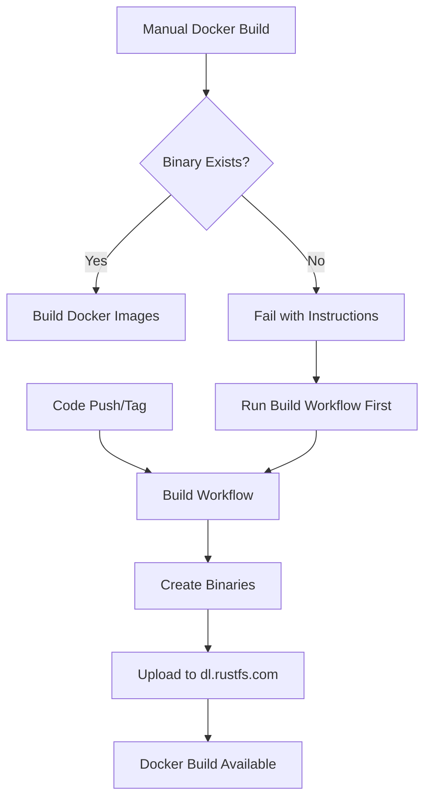

# Docker Build Version Selection Guide

This guide explains how to use the enhanced Docker build workflow with version selection capabilities.

## 🚀 Quick Start

### Automatic Builds

Docker images are automatically built in these scenarios:

- **Main branch push**: Creates development images with `dev-{sha}` tags
- **Tag push**: Creates release images with version tags
- **Pull request**: Creates test images (not pushed to registry)

### Manual Builds

You can manually trigger Docker builds with specific versions:

```bash
# Use GitHub CLI
gh workflow run docker.yml --field version=main-latest

# Or use the GitHub web interface:
# Actions → Docker Images → Run workflow
```

## 📋 Version Options

### Standard Versions

| Version Pattern | Description | Example | Build Type |
|----------------|-------------|---------|------------|
| `latest` | Latest stable release | `latest` | Release |
| `main-latest` | Latest from main branch | `main-latest` | Development |
| `v1.2.3` | Specific release version | `v1.0.0` | Release |
| `v1.2.3-alpha1` | Prerelease version | `v1.0.0-beta1` | Prerelease |
| `dev-abc123` | Specific development build | `dev-a8fbced9` | Development |

### Custom Versions

You can also specify custom version strings, but they will be treated as development builds.

## 🔧 Advanced Options

### Force Rebuild

Use the `force_rebuild` option to rebuild images even if they already exist:

```bash
gh workflow run docker.yml \
  --field version=main-latest \
  --field force_rebuild=true
```

This is useful for:

- Testing Docker build changes
- Updating base images
- Regenerating images with new dependencies

## 🐳 Image Variants

Each build creates multiple image variants:

### Production Variants

- **production** (`Dockerfile`) - Minimal Alpine-based image
- **alpine** (`.docker/alpine/Dockerfile.prebuild`) - Alpine with pre-built binary
- **ubuntu** (`.docker/ubuntu/Dockerfile.prebuild`) - Ubuntu with pre-built binary

### Development Variants

- **alpine-source** (`.docker/alpine/Dockerfile.source`) - Alpine with source build
- **ubuntu-source** (`.docker/ubuntu/Dockerfile.source`) - Ubuntu with source build

## 📦 Image Tags

### Development Builds

```
rustfs/rustfs:dev-a8fbced9-production
rustfs/rustfs:dev-a8fbced9-alpine
rustfs/rustfs:dev-production
rustfs/rustfs:dev-alpine
```

### Release Builds

```
rustfs/rustfs:v1.0.0-production
rustfs/rustfs:v1.0.0-alpine
rustfs/rustfs:v1.0.0            # main production variant
rustfs/rustfs:latest-production
rustfs/rustfs:latest             # main production variant
```

### Main-Latest Builds

```
rustfs/rustfs:main-latest-production
rustfs/rustfs:main-latest-alpine
rustfs/rustfs:dev-production     # rolling dev tag
rustfs/rustfs:dev-alpine         # rolling dev tag
```

## 🎯 Use Cases

### Testing New Features

```bash
# Build with specific development version
gh workflow run docker.yml --field version=dev-a8fbced9
```

### Release Preparation

```bash
# Build with release candidate
gh workflow run docker.yml --field version=v1.0.0-rc1
```

### Continuous Development

```bash
# Always use latest main branch
gh workflow run docker.yml --field version=main-latest
```

## ⚠️ Important Notes

### Binary Dependencies

Docker builds require pre-built binaries to exist at `https://dl.rustfs.com/`. If the binary doesn't exist:

1. **For main-latest**: Push to main branch or run build workflow
2. **For latest**: Create a release tag
3. **For dev-xxx**: Run build workflow with specific commit
4. **For v1.2.3**: Create and push the version tag

### Error Handling

If a binary doesn't exist, the build will fail with clear instructions:

```
❌ Failed to download binary from: https://dl.rustfs.com/artifacts/rustfs/dev/rustfs-linux-x86_64-main-latest.zip
💡 Please ensure the binary exists or trigger a build first
💡 Available options:
   - For main-latest: Push to main branch or run build workflow
   - For latest: Create a release tag
   - For dev-xxx: Run build workflow with specific commit
```

## 🔄 Workflow Dependencies



This ensures deterministic builds without unpredictable fallbacks.
