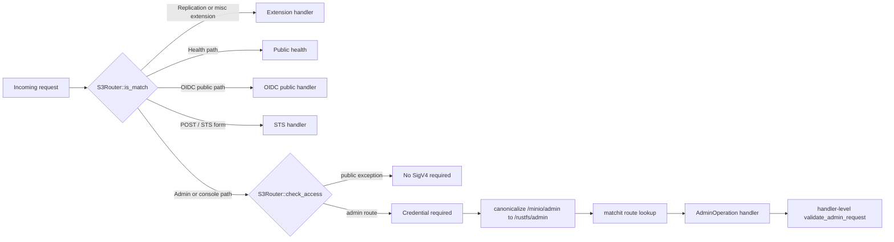

# Admin Route Action Snapshot

This snapshot records the current admin routing and authorization surface before
directory moves or crate extraction. It is a migration guardrail: later pure
move PRs must preserve the route, handler, authorization action, public
exception, and compatibility alias semantics listed here unless the PR is
explicitly scoped as a behavior change.

## Source Of Truth

- Router assembly: `rustfs/src/admin/mod.rs::make_admin_route`
- Route registration coverage: `rustfs/src/admin/route_registration_test.rs`
- Runtime dispatch: `rustfs/src/admin/router.rs`
- Admin auth helpers: `rustfs/src/admin/auth.rs`
- Handler route/action ownership: `rustfs/src/admin/handlers/*.rs`

The route registration test intentionally covers representative paths for every
registered route family. This document uses route patterns from the registration
functions and action names from the handler authorization calls.

## Prefix And Alias Contract

| Prefix | Current behavior | Migration rule |
|---|---|---|
| `/rustfs/admin` | Canonical admin API prefix used by route registration | Keep as the single registered admin prefix |
| `/minio/admin` | Compatibility alias accepted by `S3Router::is_match`; dispatch canonicalizes it to `/rustfs/admin` | Do not duplicate registrations; preserve canonicalization |
| `/iceberg/v1` table catalog prefix | Registered through `table_catalog::register_table_catalog_route` and accepted by `is_admin_path` | Keep outside `/rustfs/admin` and document auth separately |
| `/health` and `/health/ready` | Public health endpoints when `ENV_HEALTH_ENDPOINT_ENABLE` allows registration | Preserve unauthenticated health bypass |
| `/profile/cpu` and `/profile/memory` | Registered by health handler but guarded by profile auth | Do not couple to health endpoint enablement |

The compatibility alias is not a second route table. `canonicalize_admin_path`
maps `/minio/admin/...` to `/rustfs/admin/...` immediately before route lookup.

## Dispatch And Auth Shape

Route-level credential presence and handler-level policy authorization are
separate contracts. The router enforces credential presence for ordinary admin
routes. Handler rows below record whether the current handler performs a
precise `AdminAction` or `S3Action` check, or only repeats a credential
presence check.

## Public Exceptions

| Method | Path pattern | Handler | Auth contract |
|---|---|---|---|
| `GET`, `HEAD` | `/health` | `HealthCheckHandler` | Public when health routes are registered |
| `GET`, `HEAD` | `/health/ready` | `HealthCheckHandler` | Public when health routes are registered |
| Registered as `GET`; auth bypass is path-based | `/rustfs/admin/v3/oidc/providers` and `/minio/admin/v3/oidc/providers` | `ListOidcProvidersHandler` | Public OIDC bootstrap path; `check_access` bypasses SigV4 for any method matching this path |
| Registered as `GET`; auth bypass is path-prefix-based | `/rustfs/admin/v3/oidc/authorize/{provider_id}` and `/minio/admin/v3/oidc/authorize/{provider_id}` | `OidcAuthorizeHandler` | Public OIDC bootstrap path; `check_access` bypasses SigV4 for any method matching this path prefix |
| Registered as `GET`; auth bypass is path-prefix-based | `/rustfs/admin/v3/oidc/callback/{provider_id}` and `/minio/admin/v3/oidc/callback/{provider_id}` | `OidcCallbackHandler` | Public OIDC bootstrap path; `check_access` bypasses SigV4 for any method matching this path prefix |
| Registered as `GET`; auth bypass is path-based | `/rustfs/admin/v3/oidc/logout` and `/minio/admin/v3/oidc/logout` | `OidcLogoutHandler` | Public OIDC logout path; `check_access` bypasses SigV4 for any method matching this path |
| `POST` | `/` with `application/x-www-form-urlencoded` | `AssumeRoleHandle` | Public only for unsigned STS web identity form requests; handler validates JWT/action |
| Any matched method | `/favicon.ico` and `/rustfs/console...` | Console router | Public only when `console_enabled` is true; router bypasses SigV4 before handing off to the console router |

## Registered Route Families

All rows with `/rustfs/admin` also accept the `/minio/admin` compatibility alias
through router canonicalization unless the row explicitly says otherwise.

| Area | Methods and path patterns | Handler ownership | Authorization contract |
|---|---|---|---|
| STS and admin probe | `POST /`; `GET /rustfs/admin/v3/is-admin` | `sts.rs`, `is_admin.rs` | STS dispatch validates request action; is-admin checks `AllAdminActions` |
| User lifecycle | `GET /v3/list-users`; `GET /v3/user-info`; `PUT /v3/add-user`; `PUT /v3/set-user-status`; `DELETE /v3/remove-user` | `user_lifecycle.rs`, `user.rs` | `ListUsersAdminAction`, `GetUserAdminAction`, `CreateUserAdminAction`, `EnableUserAdminAction`, `DeleteUserAdminAction` |
| Group management | `GET /v3/groups`; `GET /v3/group`; `DELETE /v3/group/{group}`; `PUT /v3/set-group-status`; `PUT /v3/update-group-members` | `group.rs` | `ListGroupsAdminAction`, `GetGroupAdminAction`, `RemoveUserFromGroupAdminAction`, `EnableGroupAdminAction`, `AddUserToGroupAdminAction` |
| Service accounts | `PUT /v3/add-service-account(s)`; `POST /v3/update-service-account`; `GET /v3/info-service-account`; `GET /v3/temporary-account-info`; `GET /v3/info-access-key`; `GET /v3/list-service-accounts`; `GET /v3/list-access-keys-bulk`; `DELETE /v3/delete-service-account(s)` | `service_account.rs` | create/update/list/temp-info/user-list/remove service account actions as checked in handler context |
| IAM import/export | `GET /v3/export-iam`; `PUT /v3/import-iam` | `user_iam.rs`, `user.rs` | `ExportIAMAction`, `ImportIAMAction` |
| IAM policies | `GET /v3/list-canned-policies`; `GET /v3/info-canned-policy`; `PUT /v3/add-canned-policy`; `DELETE /v3/remove-canned-policy`; `PUT /v3/set-user-or-group-policy`; `PUT /v3/set-policy`; `POST /v3/idp/builtin/policy/attach`; `POST /v3/idp/builtin/policy/detach`; `GET /v3/idp/builtin/policy-entities` | `policies.rs` | list/create/get/delete/attach policy actions; policy-entities combines list groups, users, and policies |
| Account info | `GET /v3/accountinfo` | `account_info.rs` | S3 action checks for account-scoped bucket and object probes |
| System info | `GET /v3/info`; `GET /v3/storageinfo`; `GET /v3/datausageinfo` | `system.rs` | `ServerInfoAdminAction`, `StorageInfoAdminAction`, `DataUsageInfoAdminAction` plus `ListBucketAction` for data usage |
| Metrics stream | `GET /v3/metrics` | `metrics.rs` through `system.rs` | Router credential presence plus handler credential check; no handler-level `AdminAction` is currently enforced |
| System service placeholders | `POST /v3/service`; `GET|POST /v3/inspect-data` | `system.rs` | Currently registered but handler returns `NotImplemented`; migration must preserve this unless behavior changes |
| Pools | `GET /v3/pools/list`; `GET /v3/pools/status`; `POST /v3/pools/decommission`; `POST /v3/pools/cancel` | `pools.rs` | list/status accept server-info or decommission; decommission/cancel use `DecommissionAdminAction` |
| Rebalance | `POST /v3/rebalance/start`; `GET /v3/rebalance/status`; `POST /v3/rebalance/stop` | `rebalance.rs` | `RebalanceAdminAction` |
| Heal | `POST /v3/heal/`; `POST /v3/heal/{bucket}`; `POST /v3/heal/{bucket}/{prefix}`; `POST /v3/background-heal/status` | `heal.rs` | `HealAdminAction` |
| Tier | `GET /v3/tier`; `GET /v3/tier-stats`; `GET /v3/tier/{tier}`; `DELETE /v3/tier/{tiername}`; `PUT /v3/tier`; `POST /v3/tier/{tiername}`; `POST /v3/tier/clear` | `tier.rs` | `ListTierAction` for reads/status; `SetTierAction` for add/edit/remove/clear |
| Quota legacy and bucket-scoped | `PUT /v3/set-bucket-quota`; `GET /v3/get-bucket-quota`; `PUT|GET|DELETE /v3/quota/{bucket}`; `GET /v3/quota-stats/{bucket}`; `POST /v3/quota-check/{bucket}` | `quota.rs` | `SetBucketQuotaAdminAction` for writes; `GetBucketQuotaAction` for bucket-scoped reads/stats/checks |
| Bucket metadata | `GET /export-bucket-metadata`; `GET /v3/export-bucket-metadata`; `PUT /import-bucket-metadata`; `PUT /v3/import-bucket-metadata` | `bucket_meta.rs` | `ExportBucketMetadataAction`, `ImportBucketMetadataAction` |
| Server config | `GET /v3/get-config-kv`; `PUT /v3/set-config-kv`; `DELETE /v3/del-config-kv`; `GET /v3/help-config-kv`; `GET /v3/list-config-history-kv`; `DELETE /v3/clear-config-history-kv`; `PUT /v3/restore-config-history-kv`; `GET|PUT /v3/config` | `config_admin.rs` | `ConfigUpdateAdminAction` helper path; read/write handlers preserve current per-handler checks |
| Scanner | `GET /v3/scanner/status` | `scanner.rs` | `ServerInfoAdminAction` |
| Notification targets | `GET /v3/target/list`; `GET /v3/target/arns`; `PUT /v3/target/{target_type}/{target_name}`; `DELETE /v3/target/{target_type}/{target_name}/reset` | `event.rs` through `user_policy_binding.rs` | `GetBucketTargetAction` for list/ARNs; `SetBucketTargetAction` for put/delete |
| Audit targets | `GET /v3/audit/target/list`; `PUT /v3/audit/target/{target_type}/{target_name}`; `DELETE /v3/audit/target/{target_type}/{target_name}/reset` | `audit.rs` | `GetBucketTargetAction` for list; `SetBucketTargetAction` for put/delete |
| Module switches | `GET|PUT /v3/module-switches` | `module_switch.rs` | `ServerInfoAdminAction` for get; `ConfigUpdateAdminAction` for update |
| Plugin catalog | `GET /v4/plugins/catalog` | `plugins_catalog.rs` | `ServerInfoAdminAction` |
| Plugin instances | `GET /v4/plugins/instances`; `GET|PUT|DELETE /v4/plugins/instances/{id}` | `plugins_instances.rs` | read uses `GetBucketTargetAction`; write/delete use `SetBucketTargetAction` |
| Replication target list | `GET /v3/list-remote-targets` | `replication.rs` | Router credential presence plus handler credential check; no handler-level `AdminAction` is currently enforced |
| Replication target metrics/mutation | `GET /v3/replicationmetrics`; `PUT /v3/set-remote-target`; `DELETE /v3/remove-remote-target` | `replication.rs` | `GetReplicationMetricsAction` for metrics; `SetBucketTargetAction` for target mutation |
| Site replication | `PUT /v3/site-replication/add`; `PUT /v3/site-replication/remove`; `GET /v3/site-replication/info`; `GET /v3/site-replication/metainfo`; `GET /v3/site-replication/status`; `POST /v3/site-replication/devnull`; `POST /v3/site-replication/netperf`; `PUT /v3/site-replication/edit`; `PUT /v3/site-replication/peer/join`; `PUT /v3/site-replication/peer/bucket-ops`; `PUT /v3/site-replication/peer/iam-item`; `PUT /v3/site-replication/peer/bucket-meta`; `GET /v3/site-replication/peer/idp-settings`; `PUT /v3/site-replication/peer/edit`; `PUT /v3/site-replication/peer/remove`; `PUT /v3/site-replication/resync/op`; `PUT /v3/site-replication/state/edit` | `site_replication.rs` | add/remove/info/operation/resync actions selected per handler |
| Admin profiling | `GET /rustfs/admin/debug/pprof/profile`; `GET /rustfs/admin/debug/pprof/status` | `profile_admin.rs`, `profile.rs` | `ProfilingAdminAction` |
| TLS debug | `GET /rustfs/admin/debug/tls/status` | `tls_debug.rs`, `profile.rs` | `ProfilingAdminAction` via shared profile authorization |
| KMS legacy management | `POST /v3/kms/create-key`; `POST /v3/kms/key/create`; `GET /v3/kms/describe-key`; `GET /v3/kms/key/status`; `GET /v3/kms/list-keys`; `POST /v3/kms/generate-data-key`; `GET|POST /v3/kms/status`; `GET /v3/kms/config`; `POST /v3/kms/clear-cache` | `kms_management.rs`, `kms_keys.rs` | create/status/server-info KMS admin actions as checked per handler |
| KMS dynamic control | `POST /v3/kms/configure`; `POST /v3/kms/start`; `POST /v3/kms/stop`; `GET /v3/kms/service-status`; `POST /v3/kms/reconfigure` | `kms_dynamic.rs` | `ServerInfoAdminAction` |
| KMS keys | `POST /v3/kms/keys`; `DELETE /v3/kms/keys/delete`; `POST /v3/kms/keys/cancel-deletion`; `GET /v3/kms/keys`; `GET /v3/kms/keys/{key_id}` | `kms_keys.rs` | `KMSCreateKeyAdminAction`, `KMSKeyStatusAdminAction`, `ServerInfoAdminAction` per handler |
| OIDC public | `GET /v3/oidc/providers`; `GET /v3/oidc/authorize/{provider_id}`; `GET /v3/oidc/callback/{provider_id}`; `GET /v3/oidc/logout` | `oidc.rs` | Public OIDC exception in `is_oidc_path` |
| OIDC config | `GET /v3/oidc/config`; `PUT|DELETE /v3/oidc/config/{provider_id}`; `POST /v3/oidc/validate` | `oidc.rs` | `ServerInfoAdminAction` for read/validate; `ConfigUpdateAdminAction` for mutation |

## Table Catalog Routes

The table catalog API is registered by the admin router but is not under
`/rustfs/admin`. It has its own prefix and Iceberg-style route shape.

| Method | Path pattern | Handler | Authorization action |
|---|---|---|---|
| `GET` | `/iceberg/v1/config` | `GET_CONFIG_HANDLER` | `GetTableCatalogAction` |
| `GET` | `/iceberg/v1/{warehouse}/namespaces` | `LIST_NAMESPACES_HANDLER` | `GetTableNamespaceAction` |
| `POST` | `/iceberg/v1/{warehouse}/namespaces` | `CREATE_NAMESPACE_HANDLER` | `SetTableNamespaceAction` |
| `GET` | `/iceberg/v1/{warehouse}/namespaces/{namespace}` | `GET_NAMESPACE_HANDLER` | `GetTableNamespaceAction` |
| `DELETE` | `/iceberg/v1/{warehouse}/namespaces/{namespace}` | `DROP_NAMESPACE_HANDLER` | `DeleteTableNamespaceAction` |
| `GET` | `/iceberg/v1/{warehouse}/namespaces/{namespace}/tables` | `LIST_TABLES_HANDLER` | `GetTableAction` |
| `POST` | `/iceberg/v1/{warehouse}/namespaces/{namespace}/tables` | `CREATE_TABLE_HANDLER` | `CreateTableAction` |
| `POST` | `/iceberg/v1/{warehouse}/namespaces/{namespace}/register` | `REGISTER_TABLE_HANDLER` | `RegisterTableAction` |
| `GET` | `/iceberg/v1/{warehouse}/namespaces/{namespace}/tables/{table}` | `LOAD_TABLE_HANDLER` | `GetTableAction` |
| `POST` | `/iceberg/v1/{warehouse}/namespaces/{namespace}/tables/{table}` | `COMMIT_TABLE_HANDLER` | `CommitTableAction` |
| `DELETE` | `/iceberg/v1/{warehouse}/namespaces/{namespace}/tables/{table}` | `DROP_TABLE_HANDLER` | `DeleteTableAction` |

## Migration Rules

1. Pure move PRs may move handler modules, but must not change registered
   methods, patterns, handler ownership, alias canonicalization, or public
   exception behavior.
2. If an admin handler is wrapped to cut a dependency direction, the wrapper
   must preserve the same `AdminAction` or `S3Action` check and keep response
   compatibility unchanged.
3. Do not duplicate `/minio/admin` registrations. The alias remains a router
   canonicalization concern.
4. Do not move table catalog routes under `/rustfs/admin` during route cleanup.
5. Registered-but-`NotImplemented` routes are behavior contracts too. Removing
   or implementing them requires a behavior-change PR type.
6. Future route matrix automation should compare against this document and
   `route_registration_test.rs` before crate extraction begins.
