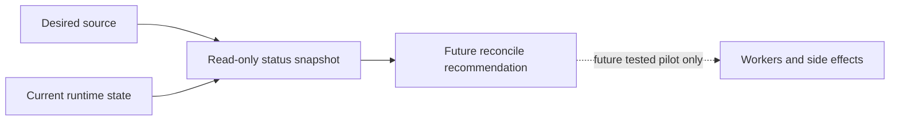

# Background Controller Contract

This document defines `BGC-002` for
[`rustfs/backlog#660`](https://github.com/rustfs/backlog/issues/660). It turns
the background service inventory into a shared vocabulary for future read-only
status work. It does not add a Rust trait, a scheduler, a service registry, or
any worker start/stop behavior.

## Scope

- PR type: `docs-only`.
- Baseline: `upstream/main` at
  `f9a5e6d7e67322ac6f626b6f437a5e722fbe22e2`.
- Applies to future controller work for scanner, heal, lifecycle, replication,
  dynamic config reload, capacity, metrics, memory observability, allocator
  reclaim, and auto-tuning.
- Out of scope: worker creation, worker shutdown, queue resizing, storage
  writes, readiness changes, peer signaling changes, scheduler replacement, and
  crate splitting.

## Contract Vocabulary

| Term | Meaning | BGC-002 boundary |
|---|---|---|
| Desired | Static intent from env, persisted config, module switches, feature flags, bucket config, or admin configuration. | Read only. Do not normalize or mutate config while collecting desired state. |
| Current | Observed local runtime state such as configured, disabled, running, degraded, stopping, or unknown. | Read only. Do not infer state by starting probes that create storage or network side effects. |
| Status | Human-readable and machine-checkable snapshot of runtime counters, worker counts, queue pressure, last successful cycle, last error, cancellation source, and shutdown handle shape. | Side-effect-free. Missing status surfaces must be reported as `unknown`, not guessed. |
| Reconcile | Future comparison between desired, current, and status that can produce a recommendation. | No action in `BGC-002`; future reconcile must not start or stop workers until a tested pilot PR allows it. |
| Side effects | Writes, deletes, queue admission, target activation, external I/O, metrics emission, readiness publication, peer signal, or config reload fanout. | Must be declared before any controller migration touches that service. |

## State Model

Future status snapshots should use the narrowest state that the current code can
prove:

| State | Meaning | Notes |
|---|---|---|
| NotConfigured | No valid desired source exists for this service. | Use when config/module switches/features make the service absent. |
| Disabled | Desired source exists and explicitly disables the service. | Do not use for missing config. |
| Starting | Startup was requested and has not reached steady state. | Only expose when current code has a start boundary. |
| Running | The service is active according to existing runtime state. | Do not use merely because config is enabled. |
| Degraded | The service is active but current status exposes known error, partial, or stalled state. | Do not introduce new failure classification in docs-only work. |
| Stopping | Shutdown was requested and the service has not fully exited. | Only expose where shutdown can be observed. |
| Stopped | The service was started before and is now fully stopped. | Do not confuse with `Disabled` or `NotConfigured`. |
| Unknown | Current code lacks a safe status surface. | Preferred over speculative status. |

## Lifecycle Boundary

`BGC-002` stops at the read-only contract. The arrow from reconcile to workers is
intentionally dotted because this PR does not allow any implementation to start,
stop, resize, or reconfigure workers.

## Service Boundaries

| Service area | Desired source | Current/status inputs | Side effects to preserve |
|---|---|---|---|
| Data scanner | Scanner env and runtime scanner config. | Admin scanner status, scanner metrics, scanner cancellation token, checkpoint/yield/alert counters. | Data usage cache updates, lifecycle evaluation, replication heal admission, scanner heal admission, alerts, and scanner metrics. |
| Heal/AHM | Heal enablement and scanner-driven heal admission. | Heal manager global channel, active task atomics, queue length atomics, AHM cancellation token. | Heal queue consumption, heal storage writes, and channel close semantics. |
| Lifecycle expiry/transition | Bucket lifecycle config and scanner event source. | Lifecycle worker counts, active tasks, queue send timeouts, transition stats, expiry/transition queues. | Object deletes, transition queueing, stale multipart cleanup, and lifecycle metrics. |
| Replication pool | Bucket/site replication config and resync admin requests. | Global replication stats, worker pool sizes, queue counters, persisted resync state, per-bucket cancel tokens. | Object replication, delete replication, queue resizing by channel close, persisted resync metadata, and admin-triggered cancel paths. |
| Dynamic config reload | Persisted server config, admin config calls, and peer snapshot signals. | Last local reload result, per-subsystem reload errors, peer reload signal result. | Scanner/heal runtime config updates, audit reload, notification reload, peer signaling, and config snapshot fanout. |
| Capacity manager | Local disk inventory and capacity feature state. | Capacity manager cache age, scheduled refresh state, last refresh result, runtime summary loop. | Global capacity cache refresh and runtime summary metrics/logging. |
| Metrics runtime | Observability metrics feature state and collector configuration. | Collector intervals, last collection result, cancellation token state, collector grouping. | Metrics collection and emission only. |
| Memory observability | Observability feature state and memory sampling config. | Sampler loop state, last sample time, last sample error, runtime cancellation token. | Memory metric emission. This is the preferred first BGC-003 status candidate. |
| Allocator reclaim | Allocator reclaim env/config and backend support. | Enabled flag, idle streak, active request gauge, scanner/heal activity gauges, last reclaim result. | Backend-specific allocator reclaim and metrics. |
| Auto-tuner | `RUSTFS_AUTOTUNER_ENABLED` and tuning inputs. | Last tuning attempt, last tuning error, 60-second loop state. | Runtime concurrency tuning. Treat as behavior-sensitive. |

The following areas stay outside the first controller migrations:

- deferred IAM recovery, because it can publish readiness;
- optional protocol servers, because they already have protocol shutdown handles;
- ECStore endpoint monitor and disk health monitor, because they are storage-
  adjacent and can affect disk state;
- notification and audit runtime coupling, because live streams, replay, target
  activation, and reload behavior need dedicated preservation tests.

## Read-Only Snapshot Requirements

Any future `BGC-003` status implementation must satisfy all of these:

- status collection must not start, stop, resize, or wake a worker;
- status collection must not write storage data, object metadata, target state,
  queue entries, persisted config, or resync metadata;
- status collection must not publish readiness or peer reload signals;
- missing fields must be represented as `unknown` or omitted with a documented
  reason;
- cancellation source and shutdown handle shape must be reported separately from
  desired enabled/disabled state;
- scanner, heal, lifecycle, and replication status must not hide their queue and
  admission coupling.

## BGC-003 Snapshot Pilot

The first read-only snapshot is memory observability status. It reports the
service name, whether observability metrics currently enable the sampler, the
configured sampler interval, runtime-token cancellation state, and the absence
of a dedicated shutdown handle.

This snapshot intentionally does not define an admin route, scheduler, service
registry, worker start/stop path, readiness signal, peer signal, storage write,
or metrics emission change.

## BGC-004 Controller Pilot

The first controller pilot is also memory observability. It converts the
existing desired inputs and status snapshot into a typed reconcile plan. The
pilot reports desired state, current state, and worker mutation intent.

The only allowed worker mutation for this pilot is `none`. Repeated reconcile
calls must return the same plan for the same snapshot and must not request a
worker start, stop, resize, wakeup, storage write, readiness signal, peer
signal, or metrics emission.

## BGC-005 Allocator Reclaim Status And Controller Surface

The second low-risk controller/status surface is allocator reclaim. It reports
the service name, desired enablement, configured force flag, backend-specific
effective force, idle interval settings, runtime-token cancellation state, and
the absence of a dedicated shutdown handle.

The only allowed worker mutation for this surface is `none`. Reconcile output is
read-only and must not start, stop, resize, wake, or otherwise drive the
allocator reclaim loop. Existing backend-specific force handling, idle-streak
logic, metrics emission, and runtime-token shutdown behavior remain owned by the
current loop.

## BGC-006 Metrics Runtime Status And Controller Surface

The third low-risk controller/status surface is metrics runtime. It reports the
service name, observability metrics enablement, collector task count, configured
collector intervals, replication bandwidth zero-tombstone cycle count,
runtime-token cancellation state, and the absence of a dedicated shutdown
handle.

The only allowed worker mutation for this surface is `none`. Reconcile output is
read-only and must not start, stop, resize, wake, or otherwise drive metrics
collector tasks. Existing collector grouping, interval parsing, metrics
emission, replication bandwidth tombstone handling, and runtime-token shutdown
behavior remain owned by the current loops.

## Future Reconcile Rules

Future reconcile work is allowed only after a read-only status snapshot exists.
The first reconcile pilot must:

- choose one low-risk service;
- compare desired/current/status without side effects;
- prove idempotence under repeated calls;
- prove no duplicate workers are created;
- preserve existing shutdown order and cancellation source;
- include rollback guidance that removes the pilot without changing existing
  worker behavior.

Memory observability is the recommended first candidate because it already has a
simple runtime cancellation loop and no storage writes. Scanner, heal,
replication, lifecycle, disk health, deferred IAM recovery, and auto-tuning must
wait for focused preservation tests.

## Verification Expectations

For this docs-only contract:

- architecture migration guard scripts must pass;
- layer dependency and metrics reference guards must pass;
- no Rust source, Cargo metadata, CI workflow, Makefile, or runtime config file
  may change.

For the next implementation PRs:

- add focused tests before changing behavior;
- do not modify production logic only to make tests pass;
- keep compatibility comments searchable with `RUSTFS_COMPAT_TODO(<task-id>)`
  whenever temporary old paths are retained for later deletion.
