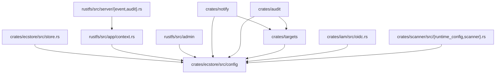

# ECStore Config Consumer Inventory

This inventory is the Phase 0 baseline for moving
`rustfs_ecstore::config::{Config, KV, KVS}` safely. It records the current
definitions, persistence helpers, global accessors, and direct consumers before
any contract extraction, global-state migration, or crate split.

Related issue: [`rustfs/backlog#660`](https://github.com/rustfs/backlog/issues/660)

## Scope

In scope:

- `rustfs_ecstore::config::KV`
- `rustfs_ecstore::config::KVS`
- `rustfs_ecstore::config::Config`
- `rustfs_ecstore::config::DEFAULT_KVS`
- `rustfs_ecstore::config::{get_global_server_config, set_global_server_config}`
- `rustfs_ecstore::config::com::{read_config_without_migrate, save_server_config}`
- Consumers that persist, clone, inspect, mutate, or pass these types across
  runtime boundaries.
- Selected adjacent users of `rustfs_ecstore::config::com::{read_config,
  save_config, delete_config}` and related helper variants are listed separately
  when they appear outside the core `Config`, `KV`, and `KVS` consumer map.
  This is not a complete `com.rs` move inventory; any future `com.rs` move must
  first inventory ECStore-internal persistence helper users too.

Out of scope:

- Unrelated `Config` types from `rustfs::config`, SDKs, TLS, SSH, KMS, OIDC
  client libraries, or local module-specific config structs.
- Storage-class-only imports are not treated as `Config`, `KV`, or `KVS`
  consumers unless they also use the server-config model.
- Pure route/action snapshot work already covered by
  [`admin-route-action-snapshot.md`](admin-route-action-snapshot.md).

## Current Shape

Arrows show current source dependency or call direction: the left node imports
or calls the right node.

The config model is currently both a persisted server-config representation and
the runtime carrier for notify, audit, target-plugin, scanner, and OIDC
settings. Any move must preserve that dual role until consumers are migrated
behind narrower contracts.

## Core Model And Global State

| Item | Current owner | Current role | Migration note |
|---|---|---|---|
| `KV` | `crates/ecstore/src/config/mod.rs` | Key/value entry with `hidden_if_empty` metadata and serde compatibility. | Preserve field names, aliases, defaults, and redaction behavior before any model move. |
| `KVS(Vec<KV>)` | `crates/ecstore/src/config/mod.rs` | Ordered key/value set used by server config, target factories, admin rendering, tests, and examples. | Preserve tuple shape and methods: `new`, `get`, `lookup`, `is_empty`, `keys`, `insert`, `extend`. |
| `Config(HashMap<String, HashMap<String, KVS>>)` | `crates/ecstore/src/config/mod.rs` | Server config map by subsystem and target. | Direct `.0` access is widespread; add wrappers only after preserving the current public shape. |
| `DEFAULT_KVS` | `crates/ecstore/src/config/mod.rs` | Registry for defaults across storage class, scanner, notify, audit, and OIDC. | Move defaults only after an explicit registration contract exists. |
| `GLOBAL_SERVER_CONFIG` | `crates/ecstore/src/config/mod.rs` | Process-wide mutable server config snapshot. | Migrate readers behind `AppContext` or a server-config provider before changing storage. |
| `ConfigSys::init` | `crates/ecstore/src/config/mod.rs` | Reads persisted config, looks up derived config, and stores the global snapshot. | Startup order must remain unchanged until the lifecycle contract owns this dependency. |
| `read_config_without_migrate` | `crates/ecstore/src/config/com.rs` | Loads persisted server config through `StorageAPI`. | Persistence stays in `ecstore` until pure model and persistence are separated. |
| `save_server_config` | `crates/ecstore/src/config/com.rs` | Persists the canonical server config object. | Preserve external object shape and config-history behavior. |
| `get_global_server_config` / `set_global_server_config` | `crates/ecstore/src/config/mod.rs` | Clone/read and replace the global server-config snapshot. | Do not remove until all runtime readers have an injected provider path. |

## Consumer Map

### ECStore Ownership, Persistence, And Defaults

| Files | Current usage |
|---|---|
| `crates/ecstore/src/config/mod.rs` | Defines `KV`, `KVS`, `Config`, defaults, global snapshot, initialization, and tests. |
| `crates/ecstore/src/config/com.rs` | Encodes, decodes, reads, writes, creates, and normalizes server config objects through `StorageAPI`. |
| `crates/ecstore/src/config/{notify,audit,oidc,scanner,storageclass}.rs` | Register default `KVS` values and subsystem-specific parsing helpers. |
| `crates/ecstore/src/store.rs` | Exposes store-level server-config accessors that delegate to the global config snapshot. |

### App Context And Server Startup Consumers

| Files | Current usage |
|---|---|
| `rustfs/src/app/context.rs` | Defines `ServerConfigInterface`, keeps an `AppContext` server-config handle, and still falls back to `get_global_server_config`. |
| `rustfs/src/server/event.rs` | Resolves server config through app context/global fallback before starting the notification runtime. |
| `rustfs/src/server/audit.rs` | Resolves server config through app context/global fallback before starting the audit runtime. |

### Admin Control-Plane Readers And Writers

| Files | Current usage |
|---|---|
| `rustfs/src/admin/handlers/config_admin.rs` | Reads active/persisted server config, validates against `DEFAULT_KVS`, mutates `KVS`, saves config history, saves server config, and updates the global snapshot. |
| `rustfs/src/admin/handlers/oidc.rs` | Reads and writes OIDC provider `KVS`, saves server config, and compares persisted config against the global snapshot for restart signaling. |
| `rustfs/src/admin/handlers/audit_runtime_config.rs` | Reads persisted config, applies audit runtime target changes, saves server config, and reloads audit runtime state. |
| `rustfs/src/admin/handlers/notify_runtime_access.rs` | Reads notification runtime config snapshots and passes `KVS` target changes into the notification system. |
| `rustfs/src/admin/handlers/{event,audit}.rs` | Lists and validates notification/audit targets from `Config`; tests build `KV` and `KVS` fixtures. |
| `rustfs/src/admin/handlers/plugins_instances.rs` | Maps target plugin `KVS` to response payloads and applies runtime target edits. |
| `rustfs/src/admin/handlers/target_descriptor.rs` | Converts descriptor payloads into `KVS` for target plugin instances. |
| `rustfs/src/admin/handlers/site_replication.rs` | Reads global server config for LDAP settings and parses LDAP `KVS` fixtures. |
| `rustfs/src/admin/service/config.rs` | Reads persisted server config, validates storage-class `KVS`, derives target state, and updates global config/storage-class state. |
| `rustfs/src/admin/router.rs` | Reads persisted/global server config for admin route behavior; route tests construct `Config`, `KV`, and `KVS`. |

### Adjacent ECStore Config-Object Helper Users

| Files | Current usage |
|---|---|
| `rustfs/src/admin/handlers/kms_dynamic.rs` | Uses generic `read_config` and `save_config` for dynamic KMS config objects. |
| `rustfs/src/admin/handlers/site_replication.rs` | Uses generic `read_config`, `save_config`, and `delete_config` for site-replication state objects. |
| `rustfs/src/admin/service/site_replication.rs` | Uses generic `read_config` and `save_config` for site-replication state normalization. |
| `rustfs/src/server/module_switch.rs` | Uses generic `read_config` and `save_config` for module-switch config objects. |
| `crates/iam/src/store/object.rs` | Uses generic `read_config_no_lock`, `read_config_with_metadata`, `save_config`, `save_config_with_opts`, and `delete_config` helper variants for IAM object-store persistence paths. |
| `crates/scanner/src/{scanner,data_usage_define}.rs` | Uses generic `read_config` and `save_config` for scanner metadata and cache persistence paths. |

### Runtime Target, Notify, And Audit Crates

| Files | Current usage |
|---|---|
| `crates/notify/src/{global,integration,services,registry}.rs` | Carries `Config` into notification runtime startup/reload and target creation. |
| `crates/notify/src/config_manager.rs` | Mutates `Config`, reads persisted server config with `read_config_without_migrate`, persists changes with `save_server_config`, and applies per-target `KVS` updates. |
| `crates/notify/src/factory.rs` | Builds notification target arguments from `KVS`. |
| `crates/notify/examples/{full_demo,full_demo_one}.rs` | Constructs `Config`, `KV`, and `KVS` directly for examples. |
| `crates/audit/src/{global,system,registry}.rs` | Carries `Config` into audit runtime startup/reload and target creation. |
| `crates/audit/src/factory.rs` | Builds audit target arguments from `KVS`. |
| `crates/audit/tests/*.rs` | Constructs `Config` and `KVS` directly for runtime and parsing tests. |
| `crates/audit/README.md` | Documents current direct `Config` usage. |
| `crates/targets/src/plugin.rs` | Creates plugin targets from `Config` and merged `KVS`. |
| `crates/targets/src/catalog/builtin.rs` | Declares builtin target descriptors and default `KVS` fields. |
| `crates/targets/src/config/{common,target_args,loader,instance}.rs` | Collects, normalizes, redacts, and materializes target configs from `Config` and `KVS`, including environment overrides. |

### Identity, Scanner, Tests, And Fixtures

| Files | Current usage |
|---|---|
| `crates/iam/src/oidc.rs` | Reads global server config and parses OIDC provider `KVS`. |
| `crates/scanner/src/{runtime_config,scanner}.rs` | Reads the global server-config snapshot and resolves scanner runtime config from `Config` and `KVS`. |
| `rustfs/src/admin` handler/router tests, `crates/audit/tests/*.rs`, and selected in-crate tests in `crates/{targets,scanner}/src` | Build direct tuple-struct fixtures; use them as candidate regression guards during a pure model move. |

## Dependency Risk Classification

| Risk | Why it matters | Guardrail |
|---|---|---|
| `Config` is both persistence model and runtime input | A move can accidentally change persisted JSON/object shape or runtime target behavior. | Separate pure model contract from persistence helpers before moving `com.rs`. |
| Direct `.0` map access is common | Replacing the tuple struct too early would create broad churn and likely behavior drift. | Preserve tuple shape in the first move, then add typed readers in later PRs. |
| `KVS` is the effective target config carrier | Notify, audit, and target factories consume `KVS` after file/env merge. | Keep `KVS` API stable until target descriptor and runtime crates are behind a shared contract. |
| `DEFAULT_KVS` registration is global | Defaults are initialized centrally and used by admin validation/rendering. | Add a registration contract before changing initialization order. |
| Global snapshot readers still exist | Server, admin, IAM, scanner, and site-replication paths can still read global config. | Migrate readers through `AppContext`/provider paths in small steps after the model contract is stable. |
| Persistence helpers depend on `StorageAPI` | Moving them with the pure model would pull storage implementation dependencies upward. | Keep read/write helpers in `ecstore` until a storage-facing persistence contract is explicit. |

## Recommended Migration Order

1. Keep this inventory current while Phase 0 guardrails land.
2. Add a focused contract surface for `KV`, `KVS`, and `Config` without changing
   serialization, tuple-struct shape, or method names.
3. Add compile-time or scripted checks for temporary compatibility markers and
   config-model re-export coverage.
4. Move only the pure model and defaults registration surface after targeted
   regression checks cover unchanged persisted object shape, target `KVS` merge
   behavior, and representative admin config rendering paths.
5. Migrate global `Config` readers behind `ServerConfigInterface` or a narrower
   provider in small PRs.
6. Move persistence helpers only after `StorageAPI` dependencies can stay below
   the model contract.
7. Evaluate crate split only after consumers no longer need old paths except
   explicit `RUSTFS_COMPAT_TODO(<task-id>)` compatibility shims.

## Do-Not-Change Contract

The first migration steps must preserve:

- `KV { key, value, hidden_if_empty }` serde behavior and redaction semantics.
- `KVS(Vec<KV>)` tuple shape and public methods.
- `Config(HashMap<String, HashMap<String, KVS>>)` tuple shape and public methods.
- `Config::set_defaults`, `Config::unmarshal`, `Config::marshal`, and
  `Config::merge` behavior.
- `read_config_without_migrate` fallback/creation behavior for missing server
  config objects.
- `save_server_config` external object shape and config-history compatibility.
- Existing notify, audit, scanner, OIDC, and target-plugin enable/disable
  interpretation from `Config`/`KVS` inputs; business-rule changes stay out of
  migration PRs.
- AppContext/global fallback behavior until all readers are explicitly migrated.
