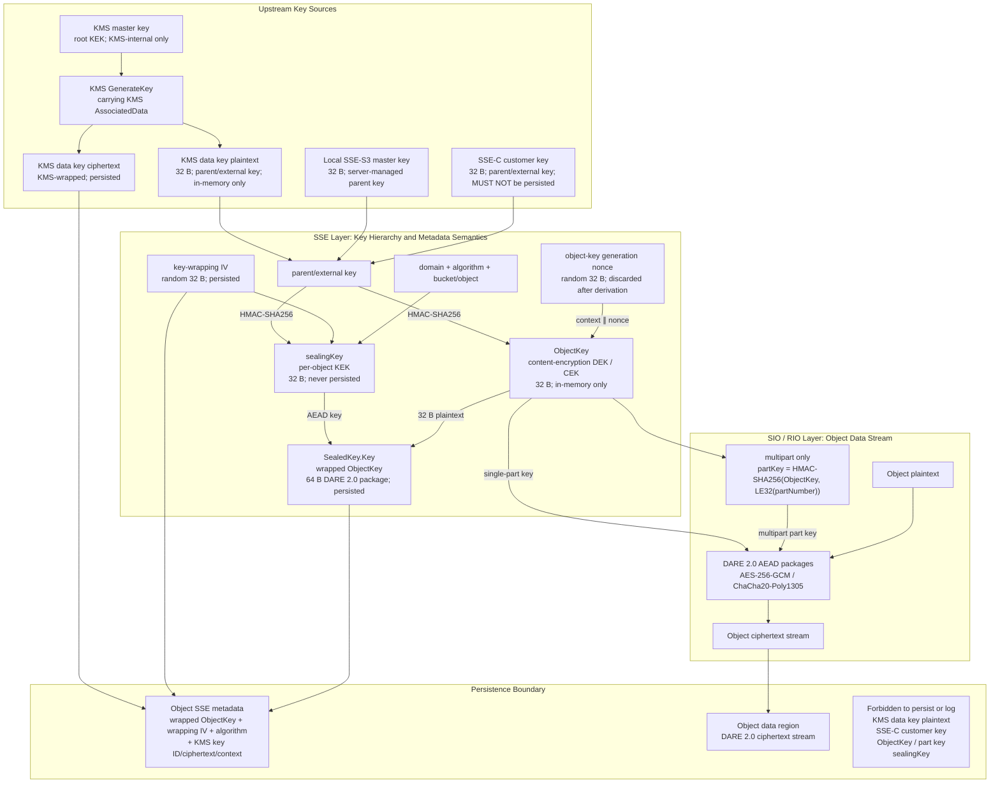

# MinIO SSE Key Hierarchy & RustFS Compatibility Contract

This document is the core reference for RustFS implementation and review of
MinIO-compatible Server-Side Encryption (SSE). It defines key terminology,
derivation relationships, inter-layer responsibilities, persistence formats,
data encryption formats for single-part and multipart objects, and the
compatibility behavior required when reading MinIO objects.

This document describes a long-term architecture contract, not a migration
plan for a specific implementation phase. The historical RustFS direct-stream
key format belongs to the read-compatibility surface and does not alter the
MinIO compatibility target specified herein.

## 1. Basis and Scope

This document takes the following source snapshots as its factual baseline:

- MinIO commit
  [`7aac2a2c5b7c882e68c1ce017d8256be2feea27f`](https://github.com/minio/minio/tree/7aac2a2c5b7c882e68c1ce017d8256be2feea27f):
  `cmd/encryption-v1.go`, `internal/crypto/key.go`,
  `internal/crypto/metadata.go`, `internal/crypto/sse-*.go`.
- RustFS commit `5ea9a1fd8f3c1b39154b27fd419cde76abc68f3b`:
  [SSE boundary](../../rustfs/src/storage/sse.rs),
  [RIO v2 encryption stream](../../crates/rio-v2/src/encrypt_reader.rs), and
  [MinIO generated fixtures](../../crates/rio-v2/tests/minio_generated_fixtures.rs).
- MinIO `sio v0.4.1` DARE 2.0 package format; the RustFS compatible
  implementation is fixed in
  [RIO v2 encryption stream](../../crates/rio-v2/src/encrypt_reader.rs).

This document covers:

- SSE-C, SSE-S3, and SSE-KMS;
- KMS envelope encryption, object key derivation, and wrapping;
- The exact meanings of `ObjectKey`, `sealingKey`, and `SealedKey`;
- The SIO/RIO DARE 2.0 data stream format;
- Multipart part keys;
- MinIO internal object metadata;
- RustFS write, read, and historical compatibility boundaries.

This document does not specify how a KMS service internally protects its KMS
master key, nor does it replace the S3 public request header and error code
API compatibility specification.

## 2. Normative Language

The terms "MUST", "MUST NOT", "SHOULD", and "MAY" in this document carry
their RFC 2119 meanings. If an implementation conflicts with this document,
the behavior that can read real MinIO objects without degrading the security
boundary takes precedence, and this document SHALL be revised accordingly.

## 3. Terminology: Named by Cryptographic Role

`key` and `data key` often refer to different roles in KMS APIs versus the
object encryption layer. Implementations and reviews MUST use the role names
in the table below as their primary reference and MUST NOT infer purpose from
variable names alone.

| Canonical Term | MinIO / RustFS Source Name | Length | Lifetime | Cryptographic Role |
|---|---|---|---|---|
| KMS master key | KMS key / master key | KMS-defined | KMS-internal only | Root key; protects the KMS data key |
| KMS data key plaintext | MinIO `key.Plaintext`; RustFS `DataKey.plaintext_key` | 32 B | Transient, in-process only | Parent/external key of the object envelope; NOT the `ObjectKey` that directly encrypts object content |
| KMS data key ciphertext | MinIO `key.Ciphertext`; RustFS `encrypted_data_key` | KMS-defined | Persisted | KMS data key plaintext wrapped under the KMS master key |
| Local SSE-S3 master key | RustFS local SSE-S3 provider master key | 32 B | Process-lifetime secret | Parent/external key for local/K/V SSE-S3; MUST NOT be persisted in object metadata |
| SSE-C customer key | SSE-C key from the client request | 32 B | In-memory for the request lifetime | Parent/external key for SSE-C |
| object-key generation nonce | Random value inside `crypto.GenerateKey` | 32 B | Discarded after derivation | Ensures distinct `ObjectKey` values under the same parent key |
| **content-encryption DEK / CEK** | **MinIO `ObjectKey`; RustFS object-key mode `key_bytes`** | **32 B** | **In-memory only** | **The key that actually encrypts object content; derives part keys for multipart** |
| key-wrapping IV | MinIO `SealedKey.IV` / `MetaIV`; RustFS `ManagedSealedKey.iv` | 32 B | Persisted | Contributes to deriving the per-object KEK |
| **per-object KEK** | **MinIO local variable `sealingKey`; RustFS `sealing_key`** | **32 B** | **Derived transiently, never persisted** | **Wraps and unwraps `ObjectKey`** |
| wrapped ObjectKey / wrapped content DEK | MinIO `SealedKey.Key`; Base64-decoded value of the corresponding metadata field | 64 B | Persisted | DARE package of `ObjectKey` AEAD-encrypted under the per-object KEK; new writes are DARE 2.0, legacy SSE-C may be DARE 1.0 |
| `SealedKey` logical record | MinIO `SealedKey { Key, IV, Algorithm }`; RustFS `ManagedSealedKey` plus algorithm constant | 64 B + 32 B + algorithm name | Persisted as multiple metadata fields | The complete ObjectKey wrapping record; NOT an object content encryption key |
| DARE stream nonce | Nonce material in the SIO/RIO DARE header | 12 B | Carried in every package header | Combined with the package sequence number to form the AEAD nonce; independent of the key-wrapping IV |
| multipart part key | MinIO `DerivePartKey`; RustFS `derive_part_key` | 32 B | In-memory only | Content-encryption DEK for each part |

### 3.1 Ambiguities That MUST Be Avoided

1. `SealedKey` is NOT "the key that participates in object content
   encryption"; it is the logical record of a wrapped `ObjectKey` and its
   unwrapping parameters.
2. `sealingKey` IS the per-object KEK; it is not an additional key layer
   beyond the KEK.
3. KMS calls its generation output a data key, but in MinIO's object
   encryption layer that plaintext data key serves as the parent/external
   key; the key that actually encrypts object content is the subsequently
   derived `ObjectKey`.
4. `SealedKey.IV` is a 32 B key-wrapping IV; the DARE data stream nonce is
   12 B. The two MUST NOT be reused, stored interchangeably, or derived from
   each other.

## 4. Overall Key Hierarchy



The minimal equivalence relationships are:

```text
ObjectKey  = content-encryption DEK / CEK
sealingKey = per-object KEK
SealedKey.Key = Wrap(sealingKey, ObjectKey) = wrapped content DEK
```

## 5. Precise Key Transformations

The concatenation operator `||` below denotes byte-string concatenation, and
integers use little-endian encoding.

### 5.1 Origin of the Parent/External Key

| SSE Mode / Provider | Parent/External Key | Upstream Action |
|---|---|---|
| SSE-C | 32 B customer key, client-provided and verified | No KMS call; customer key MUST NOT be persisted |
| SSE-S3 local/K/V | 32 B local SSE-S3 master key | No KMS call; the local parent key seals the per-object `ObjectKey` |
| SSE-S3 KMS compatibility | KMS data key plaintext generated by KMS/provider | Calls `GenerateKey` with the default service-side key ID and object context |
| SSE-KMS | KMS data key plaintext generated by KMS | Calls `GenerateKey` with the requested or default KMS key ID and KMS encryption context |

Provider choice and object write format are independent. RustFS SSE-S3 writes
MUST use the local SSE-S3 provider even when the MinIO ObjectKey write format
is enabled; configuring KMS MUST NOT change SSE-S3 write routing. SSE-KMS
writes MUST use KMS and MUST NOT fall back to the local SSE-S3 provider.

KMS-backed SSE-S3 compatibility objects and SSE-KMS objects MUST preserve
both the KMS key ID and KMS data key ciphertext so that the read path can
recover the same parent/external key via KMS. Local/K/V SSE-S3 ObjectKey
objects omit both fields simultaneously and seal `ObjectKey` directly under
the local SSE-S3 parent key. Having only one KMS field present, or either
present field empty, is corrupt metadata and MUST be rejected.

KMS AssociatedData MUST exactly reproduce MinIO:

```text
objectPath = path.Join(bucket, object)

SSE-S3 KMS compatibility:
    kmsContext = { bucket: objectPath }

SSE-KMS:
    storedContext = exact copy of the client-provided context
    kmsContext    = copy(storedContext)
    if bucket is absent from kmsContext:
        kmsContext[bucket] = objectPath
```

For SSE-KMS, if the client has explicitly provided an entry whose key equals
the current bucket name, MinIO preserves that value and does not overwrite
it; reads MUST reconstruct the same rule using the persisted `storedContext`.
The augmented `kmsContext` used for the KMS call MUST NOT overwrite the
client context that SHALL be persisted as-is. Copy, rename, and rewrap MUST
reproduce the same context rules for the corresponding source/target
operations and MUST NOT transparently forward a temporary map that lacks the
required object binding.

### 5.2 ObjectKey: Object Content DEK

MinIO's computation is:

```text
objectKeyGenerationNonce = CSPRNG(32)

ObjectKey = HMAC-SHA256(
    key  = parentExternalKey,
    data = UTF8("object-encryption-key generation")
           || objectKeyGenerationNonce
)
```

Constraints:

- `ObjectKey` MUST be 32 B.
- `objectKeyGenerationNonce` is used for exactly one derivation and is not
  persisted.
- `ObjectKey` does not include bucket/object; path binding occurs in the
  per-object KEK derivation.
- `ObjectKey` MUST NOT appear in object metadata, logs, error text, or debug
  output.

### 5.3 sealingKey: Per-Object KEK

```text
keyWrappingIV = CSPRNG(32)

sealingKey = HMAC-SHA256(
    key  = parentExternalKey,
    data = keyWrappingIV
           || UTF8(domain)
           || UTF8("DAREv2-HMAC-SHA256")
           || UTF8(canonicalBucketObjectPath)
)
```

`domain` MUST exactly match the SSE mode:

| SSE Mode | domain |
|---|---|
| SSE-C | `SSE-C` |
| SSE-S3 | `SSE-S3` |
| SSE-KMS | `SSE-KMS` |

`canonicalBucketObjectPath` MUST be consistent with MinIO's
`path.Join(bucket, object)` semantics. Any change to the path, domain,
algorithm identifier, or IV will cause unwrapping authentication failure.
Therefore, copying or renaming an object cannot simply carry over the old
`SealedKey`; it MUST re-seal against the target path, or perform a
semantically equivalent key rotation.

This canonicalization is part of the MinIO sealed-key format and SHALL only
be reproduced exactly within the sealing compatibility boundary; general
path-cleaning functions that resolve `.` or `..` MUST NOT be applied to
ordinary S3 object key paths based on this.

For KMS-backed SSE-S3 compatibility objects and SSE-KMS, a target path change
may also change the KMS AssociatedData. In that case, merely re-sealing
`ObjectKey` while keeping the old KMS data key ciphertext is insufficient;
the parent data key MUST be generated or rewrapped under the target effective
KMS context, and that parent key MUST then be used to produce a new
`SealedKey` for the target path. Only when the client's explicit SSE-KMS
context makes the source and target effective AssociatedData identical may
the corresponding KMS envelope be reused after KMS semantics have been
verified. MinIO's normal key rotation path generates a new KMS data key and
then re-seals `ObjectKey`.

### 5.4 SealedKey: Wrapped ObjectKey

```text
SealedKey.Key = DAREv2-AEAD-Encrypt(
    key       = sealingKey,
    plaintext = ObjectKey,
    aad       = DARE header[0:4],
    nonce     = DARE package nonce
)
```

The 32 B `ObjectKey` is encoded as a single DARE 2.0 package:

```text
16 B DARE header
+ 32 B ciphertext
+ 16 B AEAD tag
= 64 B SealedKey.Key
```

The MinIO writer may write AES-256-GCM or ChaCha20-Poly1305 depending on
`sio` cipher-suite selection. Compatible readers MUST accept both valid
cipher IDs:

| Cipher Suite | DARE Cipher ID |
|---|---:|
| AES-256-GCM | `0x00` |
| ChaCha20-Poly1305 | `0x01` |

The complete logical record also includes:

```text
SealedKey {
    Key:       [u8; 64], // wrapped ObjectKey package
    IV:        [u8; 32], // keyWrappingIV
    Algorithm: "DAREv2-HMAC-SHA256"
}
```

The three components are persisted separately in object metadata, not
serialized as a single structure.

### 5.5 Legacy MinIO SSE-C Seal

The MinIO reader also accepts the historical SSE-C algorithm `DARE-SHA256`:

```text
legacySealingKey = SHA256(parentExternalKey || keyWrappingIV)
ObjectKey        = sio.Decrypt(
    key        = legacySealingKey,
    minVersion = DARE 1.0,
    input      = SealedKey.Key
)
```

This format has no domain or bucket/object binding and is permitted only as
a read-only compatibility path for historical objects:

- MinIO sets `MinVersion = DARE 1.0`, so this algorithm branch may read
  DARE 1.0 or DARE 2.0 packages produced with the legacy key derivation; it
  MUST NOT be implemented as "header must be v1";
- New writes, copy targets, and rewraps MUST NOT produce `DARE-SHA256`;
- SSE-S3 and SSE-KMS MUST NOT accept this algorithm;
- Legacy identification MUST be conditioned on the SSE-C metadata shape and
  MUST NOT become a downgrade channel for arbitrarily corrupted v2 metadata;
- After a successful read, if a rewrite occurs, the object SHOULD be
  upgraded to the current `DAREv2-HMAC-SHA256` format.

## 6. DARE 2.0 Format for Object Data

The SSE layer hands the plaintext `ObjectKey` to SIO/RIO. SIO/RIO is not
responsible for:

- Calling KMS;
- Parsing SSE-C request headers;
- Generating or unwrapping `SealedKey`;
- Interpreting SSE-S3, SSE-KMS, bucket/object, or KMS context;
- Deciding SSE metadata fields.

SIO/RIO is only responsible for encrypting and decrypting the DARE data
stream using the supplied content DEK.

### 6.1 Physical Format of Each Data Package

```text
DARE 2.0 package
┌──────────────────┬──────────────────────┬──────────────────┐
│ 16-byte header   │ 1..65536 B ciphertext│ 16-byte AEAD tag │
└──────────────────┴──────────────────────┴──────────────────┘
```

Header:

| Byte | Field | Meaning |
|---:|---|---|
| `0` | version | `0x20`, DARE 2.0 |
| `1` | cipher suite | `0x00` AES-256-GCM; `0x01` ChaCha20-Poly1305 |
| `2–3` (`[2:4]`) | payload length minus one | `LE16(plaintextLength - 1)` |
| `4–15` (`[4:16]`) | stream nonce material | 12 B; the high bit also carries the final-package flag |

A zero-length plaintext is a special valid case: its ciphertext stream is
also zero bytes and produces no DARE packages, hence no final-package flag.
Only after at least one package has been observed and EOF is reached MUST
the last package be required to carry the final flag; an empty stream MUST
NOT be misclassified as truncated.

For package sequence number `sequenceNumber`:

```text
packageNonce = header[4:16]
packageNonce[8:12] ^= LE32(sequenceNumber)

ciphertext || tag = AEAD-Encrypt(
    key       = ObjectKey or partKey,
    nonce     = packageNonce,
    plaintext = packagePlaintext,
    aad       = header[0:4]
)
```

Constraints:

- The first package of a given DARE stream has sequence number `0`,
  monotonically increasing thereafter.
- The final-package flag MUST be covered by AEAD authentication.
- The reader MUST verify the complete AEAD tag before releasing that
  package's plaintext to the upper layer.
- The header nonce is the DARE stream nonce, NOT `SealedKey.IV`.
- Maximum plaintext per package is 64 KiB; each package adds a fixed 32 B
  framing overhead.

### 6.2 Multipart Part Key

Multipart objects do not directly use `ObjectKey` to encrypt all parts.
Each part first derives:

```text
partKey = HMAC-SHA256(
    key  = ObjectKey,
    data = LE32(partNumber)
)
```

Each part is then an independent DARE stream:

- Uses the corresponding `partKey`;
- The MinIO writer uses
  `SHA256(fmt.Append(nil, uploadID, partNumber))[0:12]` as the stream
  nonce; here `fmt.Append` is Go textual concatenation of upload ID and part
  number;
- Sequence number restarts from `0`;
- Part boundaries MUST be accurately recovered from the actual/encrypted
  part sizes in metadata.

Decimal strings, network byte order, or zero-based part indices MUST NOT
replace `LE32(partNumber)`.

The part number in the partKey derivation is `LE32`, but the part number in
the MinIO stream nonce input is the Go textual representation; the two
encodings differ. The DARE header carries its own nonce, so readers verify
against the header for interoperability. MinIO's deterministic nonce is a
recognized historical write behavior, not a requirement for new RustFS
writes: re-uploading different plaintext under the same upload ID and part
number would reuse the same AEAD key/nonce with that same partKey. New
RustFS writes MUST generate a random, non-repeating stream nonce for each
part write; this is DARE-semantically interoperable with the MinIO reader
but does not target byte-level identical output with the MinIO writer.

### 6.3 Derivation Keys for ETag and Other Internal Object Metadata

In addition to encrypting object content, `ObjectKey` also serves as the
root for several internal metadata sub-keys. This logic belongs at the
SSE/object-metadata boundary, not in RIO's `SealedKey` management.

MinIO's derivation for a non-empty ETag:

```text
etagKey    = HMAC-SHA256(ObjectKey, UTF8("SSE-etag"))
sealedETag = DARE-Encrypt(etagKey, etag)
```

A typical 16 B MD5 ETag becomes a `16 B header + 16 B ciphertext + 16 B tag
= 48 B` sealed ETag. An empty ETag remains empty; on read, a 16 B backend
ETag is treated as an unsealed plain ETag and no decryption is performed.
The ETag visible to S3 clients MUST be correctly unsealed/formatted and MUST
NOT directly expose backend sealed bytes.

MinIO's general-purpose internal metadata encrypter uses:

```text
metadataKey = HMAC-SHA256(ObjectKey, UTF8(baseKey))
sealedValue = DARE-Encrypt(metadataKey, value)
```

For example, the compression index uses an independent `baseKey`. Each
`baseKey` is a key-domain label and MUST exactly match MinIO; empty values
remain empty. Implementations MUST NOT directly reuse `ObjectKey` with the
same AEAD nonce to encrypt these metadata values.

## 7. MinIO Internal Metadata Persistence Contract

These fields are internal object metadata; not all of them should be
returned to S3 clients. Binary values are standard Base64 encoded.

RustFS writes of internal object metadata MUST additionally observe the
repository's twin-key rule: write the same semantic value under both
`x-rustfs-internal-<suffix>` and `x-minio-internal-<suffix>`, and on read
prefer the RustFS key while remaining compatible with objects that have only
the MinIO key. The table below lists the MinIO keys required for MinIO
interoperability; the RustFS twin key does not replace them. Write, delete,
and rotate operations MUST handle both keys simultaneously to prevent stale
values from "resurrecting" on the next read.

### 7.1 Common Fields

| MinIO Metadata Key | Value | Required When |
|---|---|---|
| `X-Minio-Internal-Server-Side-Encryption-Seal-Algorithm` | `DAREv2-HMAC-SHA256` | MinIO-style sealed ObjectKey |
| `X-Minio-Internal-Server-Side-Encryption-Iv` | Base64(32 B key-wrapping IV) | MinIO-style sealed ObjectKey |
| `X-Minio-Internal-Encrypted-Multipart` | multipart marker | Encrypted multipart object |

### 7.2 Per-SSE-Mode Fields

| Mode | Wrapped ObjectKey Field | KMS Key ID | KMS Data Key Ciphertext | KMS Context |
|---|---|---|---|---|
| SSE-C | `X-Minio-Internal-Server-Side-Encryption-Sealed-Key` | Not stored | Not stored | Not stored |
| SSE-S3 local/K/V | `X-Minio-Internal-Server-Side-Encryption-S3-Sealed-Key` | Not stored | Not stored | Not stored |
| SSE-S3 KMS compatibility | `X-Minio-Internal-Server-Side-Encryption-S3-Sealed-Key` | `X-Minio-Internal-Server-Side-Encryption-S3-Kms-Key-Id` | `X-Minio-Internal-Server-Side-Encryption-S3-Kms-Sealed-Key` | Typically no client context |
| SSE-KMS | `X-Minio-Internal-Server-Side-Encryption-Kms-Sealed-Key` | `X-Minio-Internal-Server-Side-Encryption-S3-Kms-Key-Id` | `X-Minio-Internal-Server-Side-Encryption-S3-Kms-Sealed-Key` | `X-Minio-Internal-Server-Side-Encryption-Context`, Base64(JSON) |

Note two easily confused fields:

```text
...-Kms-Sealed-Key
    = wrapped ObjectKey
    = content DEK wrapped under the per-object sealingKey

...-S3-Kms-Sealed-Key
    = KMS data key ciphertext
    = parent/external key wrapped under the KMS master key
```

These are at different envelope layers and MUST NOT be interchanged.

The KMS encryption context is a Base64-encoded JSON AssociatedData that
provides only KMS authentication binding, not confidentiality. It appears in
`xl.meta`, backups, and diagnostic data, and therefore MUST NOT contain
tokens, passwords, plaintext keys, personally sensitive information, or
other secrets; it MUST NOT be written to logs, audit events, notification
events, or client responses.

### 7.3 Materials That MUST NOT Be Persisted

The following materials MUST NOT enter `xl.meta`, user metadata, bucket
metadata, logs, audit events, notification events, error messages, or
metrics labels:

- KMS data key plaintext;
- SSE-C customer key;
- `ObjectKey`;
- Multipart `partKey`;
- `sealingKey`;
- Any debug structure from which the above plaintext keys could be
  recovered.

Types that carry the above plaintext materials MUST additionally:

- Use a secret wrapper and zeroize on drop in a way that the compiler cannot
  optimize away;
- Zeroize on error, cancellation, and early-return paths as well;
- Not implement or derive `Debug`, `Display`, or `Serialize` in a way that
  would expose their contents;
- Avoid unnecessary `Clone` and MUST NOT copy bare `[u8; 32]` or `Vec<u8>`
  across async tasks;
- Treat core dumps, swap, telemetry samples, and crash diagnostics as
  sensitive memory.

## 8. Write and Read Sequence

All three modes share the same main flow:

```text
Prepare parent/external key
  -> Derive ObjectKey and sealingKey
  -> Generate and persist the complete envelope metadata
  -> Hand ObjectKey/partKey to RIO to produce DARE ciphertext
  -> Atomically commit metadata and ciphertext in the same object generation
  -> Wipe all plaintext keys
```

Mode differences are only in the parent key and persisted envelope:

| Mode | Write Preparation | Additional Persistence | Read Recovery |
|---|---|---|---|
| SSE-C | Verify customer key and MD5 | No KMS fields | Client provides customer key again |
| SSE-S3 local/K/V | Load local SSE-S3 parent key | No KMS fields | Local SSE-S3 provider supplies the parent key |
| SSE-S3 KMS compatibility | Call KMS/provider with default service-side key ID | KMS key ID + KMS ciphertext | KMS unwraps parent key |
| SSE-KMS | Request/default key ID, construct context per §5.1 | KMS key ID + ciphertext + original client context | Reconstruct effective context, then KMS unwraps |

Reads execute the strict reverse: parse the complete envelope, recover the
parent key, derive sealingKey, AEAD-unwrap `ObjectKey`, then RIO uses
`ObjectKey`/partKey to authenticate each package and return plaintext. Any
missing field, illegal Base64, wrong length, unsupported algorithm/cipher,
path or KMS context mismatch, or AEAD tag failure MUST fail explicitly; MUST
NOT fabricate success with a default key, zero key, truncated value, or
legacy fallback.

## 9. Layered Responsibility Contract

### 9.1 S3 API / Application Layer

Responsible for:

- Parsing and validating public SSE request headers;
- Deciding SSE-C, SSE-S3, or SSE-KMS;
- Passing bucket, object, KMS key ID, and context;
- Organizing copy, multipart, range, and error mapping;
- Ensuring the encryption reader is actually in the final write-to-disk
  chain.

MUST NOT:

- Implement key derivation on its own;
- Expose internal SSE metadata as user metadata;
- Rely solely on metadata claiming the object is encrypted without verifying
  actual on-disk bytes.

### 9.2 SSE / Key-Management Layer

Solely responsible for:

- Calling KMS/provider;
- Generating and recovering parent/external keys;
- Deriving `ObjectKey`;
- Deriving per-object `sealingKey`;
- Sealing/unsealing `ObjectKey`;
- Generating, parsing, and validating SSE metadata;
- Binding domain, algorithm, and bucket/object;
- Managing the lifecycle of plaintext keys.

### 9.3 SIO / RIO Layer

Only responsible for:

- Receiving `ObjectKey` or `partKey`;
- Generating and managing DARE stream nonces;
- Maintaining sequence numbers;
- Producing and parsing DARE 2.0 packages;
- Performing AEAD encryption/decryption and tag verification;
- Supporting sequence/boundary positioning as required by parts and ranges.

The RIO API SHALL NOT receive `SealedKey`, KMS key ID, KMS ciphertext, or
KMS context.

### 9.4 Storage / Erasure Layer

Responsible for persisting:

- The encrypted DARE data stream;
- The internal SSE metadata, intact and complete;
- Information needed for reads, such as part sizes and object actual size.

The Storage layer MUST NOT have persistence semantics for plaintext keys,
nor attempt to reconstruct `ObjectKey` on its own.

## 10. RustFS Implementation Navigation

The following anchors locate implementations and do not, by their mere
presence, prove complete interoperability:

| Specification Role | RustFS Implementation Anchor |
|---|---|
| SSE boundary | [rustfs/src/storage/sse.rs](../../rustfs/src/storage/sse.rs) |
| ObjectKey derivation | `derive_object_key` |
| Per-object KEK derivation | `derive_sealing_key` |
| ObjectKey seal/unseal | `seal_object_key` / `unseal_object_key` |
| Complete wrapping record | `ManagedSealedKey` |
| SSE-to-RIO material | `EncryptionMaterial` / `DecryptionMaterial` |
| Key semantic label | `EncryptionKeyKind::Object` |
| DARE data stream | [crates/rio-v2/src/encrypt_reader.rs](../../crates/rio-v2/src/encrypt_reader.rs) |
| Multipart part key | `derive_part_key` |
| MinIO metadata/`xl.meta` fixtures | [crates/rio-v2/tests/minio_generated_fixtures.rs](../../crates/rio-v2/tests/minio_generated_fixtures.rs) |
| MinIO end-to-end read fixtures | [crates/ecstore/tests/minio_generated_read_test.rs](../../crates/ecstore/tests/minio_generated_read_test.rs) |

`EncryptionKeyKind::Direct` and the `x-rustfs-encryption-*` fields belong to
the historical RustFS direct-stream key format. The compatibility principles
are:

1. Existing historical objects SHALL remain readable unless a verified
   migration and rollback plan exists.
2. MinIO-compatible object-key mode MUST follow the `ObjectKey` /
   `SealedKey` hierarchy defined in this document.
3. Legacy fallback MUST NOT swallow format corruption, wrong keys, or
   authentication failures.
4. New MinIO compatibility tests MUST use real MinIO generated fixtures, not
   only RustFS self-write-self-read round trips.

## 11. Compatibility and Security Invariants

Any SSE/RIO modification MUST preserve the following invariants.

### 11.1 Format Invariants

- `ObjectKey`, parent/external key, sealingKey, and partKey are all 32 B.
- Wrapping IV is 32 B; DARE stream nonce is 12 B.
- Wrapped `ObjectKey` is fixed at 64 B; new writes are DARE 2.0 packages,
  and the legacy SSE-C reader additionally accepts DARE 1.0 packages meeting
  §5.5.
- New writes' seal algorithm is exactly `DAREv2-HMAC-SHA256`.
- Domain exactly matches the SSE mode.
- Bucket/object canonicalization is consistent with MinIO `path.Join`
  semantics.
- DARE header, cipher ID, payload length, final flag, and AEAD tag MUST be
  validated.
- Zero-length plaintext corresponds to a zero-byte DARE stream; only
  non-empty streams require the final package.
- Multipart part key uses `HMAC-SHA256(ObjectKey, LE32(partNumber))`.
- New writes only use `DAREv2-HMAC-SHA256`; legacy `DARE-SHA256` is only
  permitted for the SSE-C reader under strict legacy format recognition.

### 11.2 Security Invariants

- All random values come from a CSPRNG.
- The same key/nonce combination MUST NOT be reused.
- Package plaintext MUST NOT be released before AEAD tag verification
  completes.
- Any plaintext key MUST NOT be persisted or logged.
- Plaintext keys MUST be carried by a secret type that is non-printable,
  non-serializable, and zeroizes on drop.
- Corrupt metadata MUST fail closed.
- Copy/rename/replication MUST NOT break bucket/object cryptographic binding.
- SSE metadata SHALL NOT serve as sufficient evidence that "on-disk content
  is encrypted"; tests MUST inspect actual stored bytes.
- Internal SSE metadata MUST NOT be echoed as user-controllable or
  client-visible metadata.

### 11.3 MinIO Interoperability Invariants

- The reader MUST accept AES-256-GCM and ChaCha20-Poly1305 sealed ObjectKeys
  legitimately written by MinIO.
- KMS-backed SSE-S3 compatibility objects and SSE-KMS objects MUST save and
  parse the KMS data-key ciphertext and wrapped ObjectKey as separate layers;
  local/K/V SSE-S3 objects have only the wrapped ObjectKey layer.
- New KMS-backed writes MUST save KMS key ID/ciphertext as a pair. Only an
  SSE-S3 sealed-key marker with both KMS fields absent identifies the local
  K/V shape; an SSE-KMS sealed-key marker always requires the pair. If only
  one field is present, the metadata is corrupt; if both fields are present,
  the metadata belongs to the KMS-backed branch and empty values MUST NOT be
  treated as absent.
- Provider routing MUST NOT guess from the byte shape of the KMS ciphertext:
  the historical K/V shape is identified by KMS key ID/ciphertext both
  absent; when both fields are present they uniformly belong to the
  KMS-backed branch, including when either value is empty and subsequently
  rejected as invalid. MinIO static KMS modern binary ciphertext and
  external KMS ciphertext are both opaque bytes and cannot be reliably
  distinguished.
- Only when the key ID in
  `RUSTFS_MINIO_STATIC_KMS_KEY=<key-id>:<base64-32-byte-key>` exactly
  matches the object's persisted key ID SHALL the reader unwrap locally
  using the MinIO static KMS format; on mismatch it MUST delegate to the
  external KMS. Opportunistic fallback is forbidden. This configuration
  supports the modern binary AES-256-GCM envelope and the historical Base64
  JSON `AES-256-GCM-HMAC-SHA-256` / `ChaCha20Poly1305` envelope.
- The key ID in the static KMS configuration is the sole provider
  declaration for that ID within the process and MUST NOT duplicate a key ID
  from the external KMS. After an ID match, if ciphertext, AAD, or tag
  verification fails, it MUST fail closed; falling back to the external KMS
  is forbidden—otherwise a key error becomes a provider-probing oracle.
  Release builds SHALL freeze the configuration on first use; changes
  require a process restart. The same persisted object MUST NOT drift
  providers across requests.
- The static KMS root key MUST be exactly 32 bytes and MUST NOT be all
  zeros.
- `RUSTFS_MINIO_STATIC_KMS_KEY` contains a plaintext root key and SHALL only
  be injected through a protected secret channel; it MUST NOT be written to
  the repository, logs, errors, audit, or object metadata.
- The Base64(JSON) representation and decryption context of the KMS context
  MUST be consistent.
- The KMS context has no confidentiality and MUST NOT contain secrets or be
  echoed to clients.
- Metadata key spelling and casing MUST be compatible with the MinIO
  persistence format.
- RustFS writes MUST preserve both the `x-rustfs-internal-*` and
  `x-minio-internal-*` twin keys; the MinIO key MUST NOT be omitted because
  the RustFS key is present.
- Real MinIO single-part, multipart, SSE-C, SSE-S3, and SSE-KMS fixtures
  MUST be parseable and readable by RustFS.
- Real four-disk local-KMS SSE-KMS fixtures generated by a fixed RustFS
  `1.0.0-beta.5` release MUST be readable through the current production
  bitrot/erasure/GET/KMS decryption chain; tests MUST NOT replace these with
  fixed-plaintext mocks that ignore the envelope, key ID, or context.

### 11.4 Concurrency and Persistence Invariants

- DARE ciphertext, SSE metadata, part metadata, and actual sizes MUST belong
  to the same object generation and become visible within the same object
  commit boundary.
- "Encrypted" metadata MUST NOT be committed before the ciphertext data;
  after crash recovery there MUST NOT be a state where metadata claims
  encryption while the data region is still plaintext or from an old
  generation.
- KMS success and key derivation completion do not imply object commit
  success; failure or cancellation paths MUST clean up temporary data and
  release all plaintext keys together with the request state.
- Copy, multipart complete, version writes, and retries MUST be idempotent:
  a once-committed object SHALL only reference wrapped keys and part
  boundaries that match its ciphertext.
- Key rotation or metadata-only rewrap MUST atomically replace the complete
  envelope while holding the corresponding object write/versioning
  coordination boundary; readers MUST NOT observe a mix of new KMS
  ciphertext with old `SealedKey`, or old KMS ciphertext with new
  `SealedKey`.
- Concurrent requests MUST NOT share mutable plaintext key buffers, nonce
  state, or DARE sequence state; each object stream and each multipart part
  MUST have independent state.
- PutPart (especially same part number), ListParts, Complete, and Abort for
  the same upload ID MUST be linearized by a per-upload coordination
  boundary. Complete MUST pin a part snapshot; only one of Complete and
  Abort may pass the final commit linearization point.
- Multipart part data/metadata SHALL only be cleaned up on a best-effort
  basis after the final generation durable commit; retries MUST be
  reentrant and MUST NOT delete the last copy referenced by a committed
  object.
- Copy/rename/rewrap MUST pin the ciphertext, SSE envelope, and part
  boundaries of the same source version/generation and commit under the
  target write lock/commit fence; rewrap uses generation CAS. Cross-generation
  splicing of envelope and ciphertext is forbidden.
- SSE commits follow the quorum/atomic commit contract of
  [erasure-coding.md](erasure-coding.md) and the generation/fencing contract
  of [unified-object-generation.md](unified-object-generation.md): temporary
  data and `xl.meta` are synced per the selected `DurabilityMode`, lock
  loss/epoch is checked before the commit rename, the directory is synced
  after rename per the durability gate, and the ACK is only sent after the
  corresponding durable boundary is reached.
- Cancellation and crash cleanup MUST distinguish pre-commit from
  post-commit: pre-commit only rolls back this request's tmp generation;
  post-commit MUST NEVER delete a visible generation. Old data and part
  metadata cleanup is best-effort only, must be reentrant, and failure MUST
  NOT turn a committed write into a reported failure.

### 11.5 Performance Invariants

- Each independent request/operation SHALL parse the same SSE metadata at
  most once, recover the parent key at most once, and unwrap the same
  `ObjectKey` at most once; within the same request, reuse across ranges,
  parts, and shards. KMS/provider calls MUST NOT be pushed down to every
  DARE package, every erasure shard, or every range block.
- Multipart initiate is responsible for generating and persisting the
  session envelope; subsequent independent UploadPart requests recover
  material from that envelope. Plaintext parent keys/`ObjectKey` MUST NOT be
  cached long-term across requests or across multipart sessions to reduce
  KMS calls.
- ObjectKey and sealingKey derivation is constant work per object; partKey
  derivation is constant work per part.
- RIO MUST maintain streaming encryption/decryption and MUST NOT buffer the
  complete object for SSE wrapping.
- Bulk paths such as ListObjects, when they must recover multiple
  ObjectKey/ETag keys, SHOULD prefer bulk KMS decrypt; when the provider
  lacks bulk capability, use bounded concurrency with an explicit batch
  limit. Serial execution of N remote KMS RTTs is forbidden, as is
  substituting long-term caching of plaintext keys for batching.
- Performance optimizations MUST NOT cache or extend the lifetime of
  plaintext keys, nor reduce work by skipping tag, nonce, final-package, or
  metadata consistency validation.

### 11.6 rio-v2 Write Format Enablement Gate

Compiling `rio-v2` only means the process has the code capability to read
and write the MinIO ObjectKey format; it does not mean every node on the
shared storage has completed the upgrade. To ensure rolling upgrades and
rollbacks:

- When `RUSTFS_SSE_RIO_V2_WRITE_FORMAT` is unset, or set to
  `legacy-direct`, the historical Direct format continues to be written; the
  rio-v2 reader can still read both Direct and MinIO ObjectKey formats.
- Only after confirming that all nodes that may read the storage pool are
  running a version that supports the ObjectKey format may
  `RUSTFS_SSE_RIO_V2_WRITE_FORMAT=minio-object-key` be uniformly set on all
  write nodes.
- Unknown configuration values MUST fail closed and MUST NOT silently fall
  back or be independently enabled by some nodes.
- `RUSTFS_MINIO_STATIC_KMS_KEY` only controls static KMS unwrapping for
  compatible reads; it does not change the write format of new objects, nor
  does it replace the formal KMS service required for SSE-KMS writes.
- New SSE-S3 writes under `minio-object-key` MUST use the local SSE-S3
  provider as the parent-key source and persist the historical K/V metadata
  shape with both KMS fields absent. Enabling this write format MUST NOT make
  SSE-S3 depend on a configured KMS service. RustFS private local envelopes
  MUST NOT be placed in the MinIO KMS ciphertext field. The reader SHALL
  remain compatible with KMS-backed historical SSE-S3 objects by routing
  their complete persisted KMS pair to KMS.
- Rolling back from `minio-object-key` to `legacy-direct` only affects
  subsequent writes; existing ObjectKey objects still require the rio-v2
  reader, so before rollback it MUST be guaranteed that old nodes will not
  take over these objects, or a verified migration/rewrap MUST be completed
  first.
- The current gate is a deployment-level consistency contract, not automatic
  peer capability negotiation. If the cluster capability epoch is integrated
  later, automatic switching SHALL only occur after all live write nodes
  have confirmed the same epoch; if any node's state is unknown,
  `legacy-direct` MUST be retained.

## 12. Required Compatibility Test Matrix

Behavior implementations MUST NOT rely solely on encrypt/decrypt round trips
within the same codebase. The following tests MUST exercise real
S3/application/storage production call chains and assert on complete bodies,
exact lengths, typed errors, or physical storage formats:

| Test Category | What MUST Be Proven |
|---|---|
| Real MinIO single-part | SSE-C, SSE-S3, and SSE-KMS objects are all completely readable with exact content and length |
| Real MinIO multipart | Part boundaries, partKey, per-part sequence reset, and complete object assembly are correct |
| Cipher-suite compatibility | Sealed ObjectKey and object content DARE stream each cover AES-256-GCM/ChaCha20-Poly1305, and cover combinations where seal and content ciphers differ |
| Metadata physical format | Required MinIO fields are present, Base64 decode lengths are correct, RustFS/MinIO twin keys are simultaneously written |
| Actual on-disk ciphertext | Stored bytes contain no known plaintext, and "encrypted" is not judged solely from SSE metadata |
| Path binding | The same wrapped ObjectKey fails to unwrap under a different bucket/object; copy to the target path succeeds |
| Path edge values | Leading/trailing slashes and legal test keys containing `.` and `..` segments match MinIO `path.Join` results |
| Range | First/last byte, 64 KiB−1/boundary/+1, exact slices across DARE packages and across multipart parts, Content-Length/Content-Range correct |
| Copy | Same/cross-bucket CopyObject and UploadPartCopy cover representative source/target SSE-C/S3/KMS combinations, pinned source version, target envelope, and path rebinding |
| Metadata corruption | Missing fields, illegal Base64, wrong length, unknown algorithm/cipher all fail explicitly |
| KMS pair consistency | Both key ID/ciphertext present succeeds; both absent routes to the recognized legacy provider; only one absent returns a typed error |
| Ciphertext corruption and truncation | Corruption of header, payload, tag, or final package never returns unauthenticated or truncated plaintext |
| Zero-length objects | Plaintext and ciphertext are both zero bytes; not misclassified as truncated due to missing final package |
| Multipart boundaries | Part number 1, maximum supported part number, empty/minimum part, and cross-64 KiB package boundaries |
| KMS context | Context absent, explicitly provided, field order variations, and mismatch scenarios match MinIO behavior |
| ETag/internal metadata | Empty, 16 B, and 48 B paths for sealed ETag, plus at least one metadata value with a distinct `baseKey` domain, match MinIO |
| Legacy MinIO SSE-C | `DARE-SHA256` historical objects readable, but new writes and corrupted v2 inputs MUST NOT enter the legacy path |
| Legacy RustFS | Recognizable old objects remain readable; corrupted MinIO format MUST NOT mistakenly enter legacy fallback |
| Crash/cancellation | Metadata and ciphertext do not mix across generations; temporary files and plaintext material do not leak |
| Secret non-leakage | Unique sentinel parent/ObjectKey/customer key does not appear in committed metadata, raw payload, tmp/rollback, error/log/audit/notification; secret wrapper drop observably zeroizes |
| KMS/parse/KDF call counts | Fake KMS, decoder, and KDF counters prove one GET/range recovers the same ObjectKey only once; package/shard count does not increase ObjectKey/sealingKey derivations; multipart range derives partKey at most once per touched part; bulk paths do not serially execute N remote KMS calls |
| Streaming memory | Constrained reader/peak memory tests prove buffering is O(package/block), not O(object/part) |

Real MinIO fixture tests MUST parse MinIO-generated persisted objects and
MUST NOT use RustFS writer on-the-fly generation fed to the RustFS reader.
The fixture corpus MUST be sanitized, pinned to a MinIO release/commit and
content hash, and included in the default CI gate. Test functions may use
`#[ignore]` to isolate expensive fixture generation, but MUST be explicitly
executed via `ignored-only` by a dedicated required workflow covered by the
relevant source path filter; they MUST NOT rely on developers running them
manually locally. When the corresponding compatibility branch is removed,
that gate MUST fail. Until that condition is met, the relevant mode MUST NOT
be marked as MinIO-interoperable.

Write compatibility MUST be inversely proven by the target MinIO release
actually HEAD/GET-ing RustFS-generated single-part, multipart, SSE-C,
SSE-S3, and SSE-KMS objects, or by using cross-implementation fixtures that
have been verified and frozen by the MinIO reader. Self-write-self-read and
expected bytes encoded by RustFS itself cannot substitute for this proof.

The test oracle MUST additionally satisfy:

- Twin-key tests SHALL assert identical values for both the RustFS and MinIO
  prefixes for every SSE suffix in the final committed `xl.meta`, and cover
  write, remove, and rotate; a write or delete that omits either prefix MUST
  fail the test.
- "Actual on-disk ciphertext" tests SHALL, after a real PUT write, read the
  storage payload bypassing SSE decode, and verify it is valid DARE framing,
  differs from the plaintext, and can be decrypted by the expected
  `ObjectKey`; merely searching physical shards for absence of contiguous
  plaintext does not constitute a proof.
- Fake KMS MUST record exact AssociatedData, covering bucket entry absent,
  preexisting, stored/effective context separation, JSON map ordering,
  mismatch, and same/cross-bucket copy/rename/rewrap; changing
  insert-if-absent or persisting the effective map MUST fail the test.
- The crash harness SHALL inject failures after data tmp write, after
  `xl.meta` tmp write, before/after commit rename, and between the two
  envelope replacements during rewrap; after restart, only a complete old or
  complete new generation may be observed. Removing generation commit,
  lock-loss fence, or CAS MUST fail the test.
- Corruption/truncation tests SHALL consume package by package and assert
  specific error categories; first-package authentication failure returns
  zero plaintext, subsequent package failures return at most the previously
  fully authenticated packages, and MUST NEVER return `Ok(wrong plaintext)`,
  silent EOF, or 200 + truncated body.
- Range tests MUST assert exact byte slices and response range headers;
  corruption of a touched package MUST error, and corruption of an untouched
  package MUST NOT pollute a valid range.
- CopyObject and UploadPartCopy MUST fail variants that "directly carry over
  old SealedKey/partKey", "use wrong source/target KMS context", and "do not
  pin source version".
- Zero-length, AES/ChaCha sealed key, AES/ChaCha content stream, legacy
  SSE-C, and multipart boundaries MUST each have at least one end-to-end
  production-path test and MUST NOT be proven only by RIO synthetic unit
  tests.
- KMS pair tests MUST distinguish both-present, both-absent, key-ID-only,
  and ciphertext-only, and MUST NOT reject legitimate legacy shapes with a
  generic "missing field failure" assertion.
- Secret sentinel tests MUST cover success, KMS error, cancellation, and
  crash paths, and capture storage/tmp, error, log, audit, and notification
  output; zeroize additionally has an observable unit test.
- Fake KMS, metadata decoder, and KDF counters MUST be attached to
  production GetObject/range/list/multipart paths; reversing in-request
  reuse, moving decrypt/KDF into the package/shard loop, or turning bulk KMS
  into serial calls MUST fail the test.

## 13. One-Sentence Architecture Conclusion

> The SSE layer owns the complete key hierarchy: it selects the local SSE-S3
> parent key, KMS data key plaintext, or SSE-C customer key according to the
> SSE mode independently of the selected write format; derives `ObjectKey`
> and the per-object `sealingKey`; and persists the wrapped `ObjectKey`. RIO
> only receives the in-memory `ObjectKey` or partKey, performs DARE 2.0 data
> stream encryption/decryption, and never interprets or creates a
> `SealedKey`.
