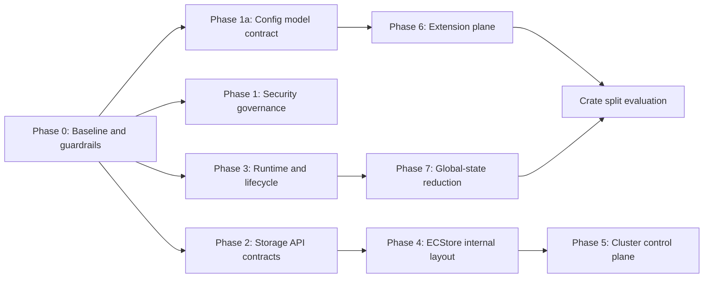

# RustFS Architecture Evolution

This document set tracks the architecture migration from
[`rustfs/backlog#660`](https://github.com/rustfs/backlog/issues/660).

## Baseline

- Baseline branch: `upstream/main`
- Baseline commit: `61f0dfbc40f748be313be84d834d8259cf3e19c9`
- Baseline title: `fix(ecstore): invalidate wiped disk id cache (#3251)`
- First migration PR type: `docs-only`

## Core Principle

Cut wrong dependency directions with directories and contracts first, migrate global
state in small steps next, and split crates only after boundaries are stable. Storage
hot-path behavior must not drift during this migration.

## Architecture Documents

- [`runtime-lifecycle.md`](runtime-lifecycle.md): runtime, AppContext,
  startup/readiness, and shutdown contracts.
- [`readiness-matrix.md`](readiness-matrix.md): request-surface behavior,
  runtime dependency readiness, probe semantics, and preservation rules.
- [`s3-tables-support-matrix.md`](s3-tables-support-matrix.md): supported,
  preview, reference-only, and not-claimed S3 Tables and Iceberg REST Catalog
  surfaces.
- [`storage-control-data-plane.md`](storage-control-data-plane.md): boundaries
  between StorageCore, ECStore, ClusterControlPlane, and BackgroundControllers.
- [`background-services-inventory.md`](background-services-inventory.md): current
  scanner, heal, lifecycle, replication, config reload, metrics, and shutdown
  surface before BackgroundController work.
- [`background-controller-contract.md`](background-controller-contract.md):
  desired/current/status/reconcile vocabulary and lifecycle boundaries for
  future read-only BackgroundController work.
- [`crate-boundaries.md`](crate-boundaries.md): PR types, crate direction,
  compatibility rules, and migration guardrails.
- [`ecstore-config-consumer-inventory.md`](ecstore-config-consumer-inventory.md):
  current `ecstore::config::{Config, KV, KVS}` definitions, consumers,
  migration risks, and do-not-change contract.
- [`config-model-boundary-adr.md`](config-model-boundary-adr.md): target crate,
  module path, dependency rules, and verification gates for moving the pure
  server-config model.
- [`migration-progress.md`](migration-progress.md): current task state and context
  handoff.
- [`compat-cleanup-register.md`](compat-cleanup-register.md): temporary
  compatibility code that must be removed later.

## Phase Order

The first implementation sequence is conservative:

1. Record baseline and migration context.
2. Establish PR and compatibility rules.
3. Add dependency and loss-prevention checks in a separate `ci-gate` PR.
4. Inventory `ecstore::config::{Config, KV, KVS}` before moving any code.
5. Decide the config model boundary before extracting or migrating consumers.
