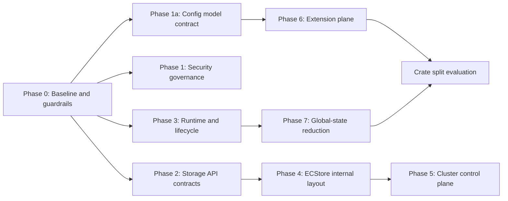

# RustFS Architecture Evolution

**Use this when:** you need the historical framing of the architecture-migration program or the phase order that the migration contracts assume.
**Source of truth:** [README.md](README.md) is the index of architecture documents; the per-topic contracts it lists are authoritative.

## Baseline

The architecture-migration program (`rustfs/backlog#660`) closed in 2026-07. Its original baseline commit predates the current `main` lineage and is no longer reachable from `main`; treat it as historical. The guardrails the program introduced remain enforced by `scripts/check_architecture_migration_rules.sh`.

## Core Principle

Cut wrong dependency directions with directories and contracts first, migrate global state in small steps next, and split crates only after boundaries are stable. Storage hot-path behavior must not drift during this migration.

## Phase Order

Historical sequencing of the migration phases. All phases are closed; the diagram is kept because later documents refer to phase names.

```mermaid
flowchart LR
    G["Phase 0: Baseline and guardrails"]
    CFG["Phase 1a: Config model contract"]
    SEC["Phase 1: Security governance"]
    API["Phase 2: Storage API contracts"]
    RT["Phase 3: Runtime and lifecycle"]
    EC["Phase 4: ECStore internal layout"]
    CP["Phase 5: Cluster control plane"]
    EXT["Phase 6: Extension plane"]
    GS["Phase 7: Global-state reduction"]
    CR["Crate split evaluation"]

    G --> CFG
    G --> SEC
    G --> API
    G --> RT
    CFG --> EXT
    API --> EC
    RT --> GS
    EC --> CP
    EXT --> CR
    GS --> CR
```

The document index is [README.md](README.md). The ECStore facade boundary that the storage phases converged on is described in [ecstore-api-facade-inventory.md](ecstore-api-facade-inventory.md).
