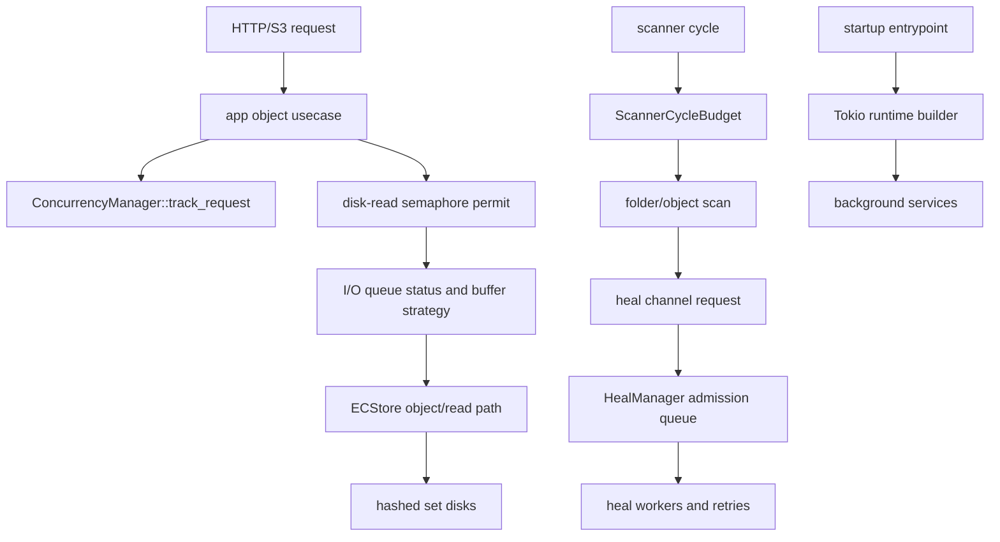

# Scheduler Baseline Inventory

This inventory covers `G-011` for `rustfs/backlog#675`. It is a docs-only
snapshot of the current scheduling, backpressure, worker, scanner, heal, and
runtime-builder ownership. It does not define new behavior.

## Current Owners

| Surface | Current owner | Current responsibility | Migration boundary |
|---|---|---|---|
| `ConcurrencyManager` | `rustfs/src/storage/concurrency/manager.rs` | Owns the RustFS S3 read-path disk-read semaphore, I/O metrics, priority queue, storage media detection, access-pattern detection, and buffer strategy. | Keep request admission and I/O metrics behavior stable until a controller can consume the same state explicitly. |
| `SchedulerManager` | `crates/concurrency/src/scheduler.rs` | Provides a reusable facade over `rustfs-io-core::IoScheduler` and derives buffer/priority decisions from `SchedulerPolicy`. | Treat it as reusable library surface; do not assume the RustFS S3 read path has already moved to this facade. |
| `BackpressureManager` | `crates/concurrency/src/backpressure.rs` | Provides a reusable duplex-pipe backpressure facade over `rustfs-io-core::BackpressureMonitor`. | Keep pipe sizing and watermark policy separate from object-read disk semaphore admission. |
| RustFS backpressure monitor | `rustfs/src/storage/backpressure.rs` | Tracks object-pipe watermark state used by RustFS storage backpressure tests and helpers. | Preserve current state labels and watermark semantics when consolidating with reusable facades. |
| `Workers` | `crates/concurrency/src/workers.rs` | Provides cooperative worker-slot admission with `take`, `give`, and `wait`; current background workflows use it for bounded set workers. | Preserve blocking/wakeup semantics and over-release clamping. |
| Scanner cycle budget | `crates/scanner/src/scanner_budget.rs` | Cancels a child token when runtime, object-count, or directory-count budget is reached. | Preserve partial-cycle reason mapping and checkpoint accounting. |
| Heal admission | `crates/heal/src/heal/manager.rs`, `crates/heal/src/heal/channel.rs`, `rustfs_common::heal_channel` | Owns priority queue admission, duplicate merge/drop/full results, active-task tracking, retry admission, and channel responses. | Preserve low-priority scanner behavior and high-priority escalation gates. |
| Tokio runtime builder | `rustfs/src/server/runtime.rs` | Builds the multi-thread runtime from env/defaults, sets thread counts, stack, queue/event intervals, I/O event cap, thread name, and optional dial9 tracing. | Keep runtime defaults and env names stable when later startup phases move ownership. |

## Current Flow

## Missing State For Later Work

`R-015` storage foundation:

- Needs a stable inventory of endpoint publication, local disk prewarm, lock
  client setup, and per-set readiness state before any scheduler/controller
  consumes storage topology.
- Must not infer set availability only from request-path I/O metrics.

`E-011` extension/runtime consumers:

- Need explicit ownership for runtime admission snapshots before extensions can
  observe scheduler or backpressure state.
- Must not receive mutable handles to `ConcurrencyManager`, heal queues, or
  scanner budget tokens.

`C-011` controller work:

- Needs desired/current/status snapshots for request admission, scanner budget,
  and heal queue pressure before any controller can reconcile them.
- Must keep worker mutation explicit. Read-only status should report `None` or
  no-op mutation until a reviewed worker lifecycle PR exists.

## Preservation Invariants

- Request reads must keep the same disk-read semaphore admission and active GET
  accounting.
- I/O queue status and congestion metrics must remain derived from the same
  permit counts.
- Scanner budget cancellation must keep its reason as runtime, objects, or
  directories.
- Scanner inline-heal compatibility must continue to use asynchronous heal
  admission.
- Heal duplicate admission must prefer merge semantics before full-queue
  rejection.
- High-priority heal admission must still be able to displace lower-priority
  queued work where the current manager allows it.
- Tokio runtime env names and fallback defaults must remain unchanged.
