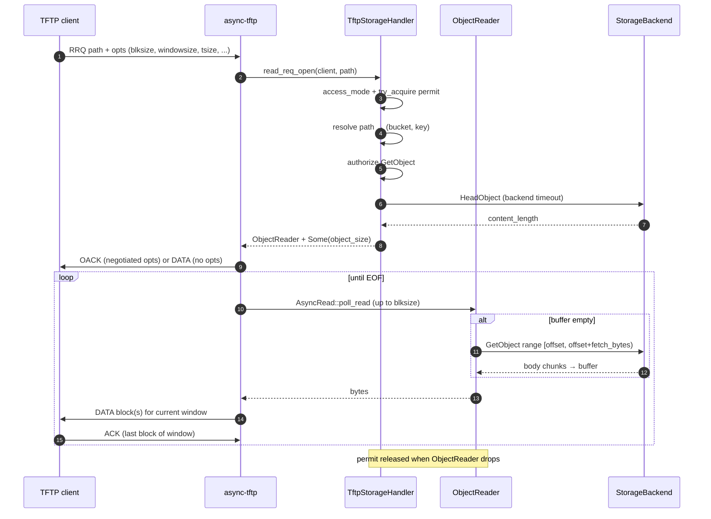

# TFTP transfer model (RRQ / WRQ)

Code entry points:

| Layer | Path |
| --- | --- |
| Server bind / library knobs | `crates/protocols/src/tftp/server.rs` (`TftpServer::start`) |
| Handler open paths | `crates/protocols/src/tftp/handler.rs` (`TftpStorageHandler`) |
| RRQ streaming | `crates/protocols/src/tftp/reader.rs` (`ObjectReader`) |
| WRQ streaming | `crates/protocols/src/tftp/writer.rs` (`ObjectWriter`) |
| Env clamp bounds | `crates/protocols/src/tftp/constants.rs` |
| Defaults / env names | `crates/config/src/constants/protocols.rs` |

Documentation: [tftp.md](tftp.md).

---

## Parameter map

| Knob | Where it applies | Meaning |
| --- | --- | --- |
| `RUSTFS_TFTP_MAX_BLOCK_SIZE` | `async-tftp` `block_size_limit` | Ceiling for negotiated RFC 2348 `blksize` (`min(client, limit)`). |
| `RUSTFS_TFTP_MAX_WINDOW_SIZE` | `async-tftp` `window_size_limit` | Ceiling for negotiated RFC 7440 `windowsize`. |
| `RUSTFS_TFTP_MAX_SEND_RETRIES` | `async-tftp` `max_send_retries` | UDP retransmit attempts after timeout before giving up (default 5 ≈ 18s with 3s timeout). |
| `RUSTFS_TFTP_MAX_CONCURRENT_TRANSFERS` | RustFS `Semaphore` | Max simultaneous RRQ+WRQ handlers; excess get TFTP `DiskFull`. |
| `RUSTFS_TFTP_MAX_TRANSFER_BYTES` | `ObjectWriter` (+ client `tsize`) | Per-WRQ byte ceiling; effective limit is `min(tsize, config)` when `tsize` is present. |
| `RUSTFS_TFTP_READ_FETCH_BYTES` | `ObjectReader` fetch window; also WRQ `part_size` floor input | RRQ: max bytes per ranged GET. WRQ: `part_size = max(read_fetch_bytes, S3_MIN_PART_SIZE)`. |
| `RUSTFS_TFTP_BACKEND_OP_TIMEOUT_SECS` | every S3 call in reader/writer/handler | Per-call backend deadline. |
| `S3_MIN_PART_SIZE` / `S3_MAX_MULTIPART_PARTS` | `ObjectWriter` | S3 multipart contract (5 MiB non-final parts; ≤ 10000 parts). |

Read/write peak memory:

- RRQ peak ≈ one `read_fetch_bytes` buffer per transfer.
- WRQ peak ≈ one `part_size` buffer per transfer (multipart), plus library UDP window buffers sized by `blksize × windowsize`.

---

## RRQ sequence (read)



Notes:

- `async-tftp` drives the UDP window; RustFS only fills bytes on demand.
- `object_size` from HEAD bounds the reader; unexpected empty range before EOF is an error.
- Failed open (auth, missing object, no permit) returns a TFTP ERROR via the library; no S3 object body is started.

---

## WRQ sequence (write)

```mermaid
sequenceDiagram
    autonumber
    participant C as TFTP client
    participant L as async-tftp
    participant H as TftpStorageHandler
    participant W as ObjectWriter
    participant S as StorageBackend

    C->>L: WRQ path + opts (incl. optional tsize)
    L->>H: write_req_open(client, path, size)
    H->>H: access_mode + try_acquire permit
    H->>H: resolve path → (bucket, key)
    H->>H: authorize PutObject
    H-->>L: ObjectWriter (max_bytes = min(tsize, max_transfer_bytes))
    L->>C: OACK / ACK#0

    loop until last DATA
        C->>L: DATA block(s) for window
        L->>W: AsyncWrite::poll_write
        W->>W: append buffer; enforce max_transfer_bytes
        alt buffer >= part_size
            opt first flush
                W->>S: CreateMultipartUpload
            end
            W->>S: UploadPart
            S-->>W: ETag
        end
        L->>C: ACK last block of window
    end

    L->>W: AsyncWrite::close (success path only)
    alt never started multipart (small object)
        W->>S: PutObject(buffer)
    else multipart
        W->>S: UploadPart(remainder) if any
        W->>S: CompleteMultipartUpload
    end
    W-->>L: Ok (completed=true)

    Note over W: Drop without close → AbortMultipartUpload if upload_id exists
```

Commit vs abort:

| Outcome | What happens |
| --- | --- |
| Full WRQ + library `close()` | `PutObject` or `CompleteMultipartUpload`; object is visible. |
| Timeout, peer ERROR, I/O error, drop without close | No commit. If multipart started, `Drop` spawns `AbortMultipartUpload`. |
| Over `max_transfer_bytes` or > 10000 parts | Write fails; multipart aborted if started. |

TFTP is UDP: cleanup is **per transfer** (`ObjectWriter` lifetime), not a session teardown like SFTP.

---

## Layering diagram

```text
  Client (atftp / firmware)          UDP :6969 (or :69)
           │
           ▼
   ┌───────────────────┐
   │     async-tftp    │  blksize / windowsize / retries / OACK
   │  RRQ/WRQ tasks    │
   └─────────┬─────────┘
             │ Handler trait
             ▼
   ┌───────────────────┐
   │ TftpStorageHandler│  IAM, path, semaphore
   └─────────┬─────────┘
             │
      ┌──────┴──────┐
      ▼             ▼
 ObjectReader   ObjectWriter
 ranged GET     PutObject / MPU
      │             │
      └──────┬──────┘
             ▼
        StorageBackend (S3 API)
```

---

## Known `async-tftp` issues and fork branches

Work tracked against crates.io `async-tftp` **0.4.2**. Three branches are pushed
to [ylw510/async-tftp-rs](https://github.com/ylw510/async-tftp-rs).

| Branch | Commit | Remote |
| --- | --- | --- |
| `fix/abort-on-peer-error` | `c8135e5` | `origin/fix/abort-on-peer-error` |
| `fix/window-retransmit-unacked-suffix` | `dceebe3` | `origin/fix/window-retransmit-unacked-suffix` |
| `feat/wrq-windowsize` | `dabfc09` | `origin/feat/wrq-windowsize` |

All three branches fork from `master` independently. Combine or rebase before
a single release pin.

### 1. `fix/abort-on-peer-error` (commit `c8135e5`)

- **Branch:** [ylw510/async-tftp-rs `fix/abort-on-peer-error`](https://github.com/ylw510/async-tftp-rs/tree/fix/abort-on-peer-error) — after OACK,
  client may send TFTP ERROR (e.g. RFC 2347 code 8). Stock `recv_ack` ignored
  non-ACK packets → server waited forever for ACK#0.
- **Fix:** treat `Packet::Error` as `Error::ClientAborted` on RRQ ACK wait and
  WRQ DATA wait; do **not** echo another ERROR.
- **RFCs:** RFC 2347 / 2348 (reject OACK → ERROR 8 terminates); RFC 1350 §7.

### 2. `fix/window-retransmit-unacked-suffix` (commit `dceebe3`)

- **Branch:** [ylw510/async-tftp-rs `fix/window-retransmit-unacked-suffix`](https://github.com/ylw510/async-tftp-rs/tree/fix/window-retransmit-unacked-suffix) —
  `windowsize > 1` (e.g. 32) with `atftp` → `got wrong block` on lossy/late ACK.
- **Cause:** RRQ `send_window` retransmitted the **entire** window on timeout.
- **Fix:** track partial ACK progress; on timeout retransmit only the **unacked
  suffix** (RFC 7440 §4).

### 3. `feat/wrq-windowsize` (commit `dabfc09`)

- **Branch:** [ylw510/async-tftp-rs `feat/wrq-windowsize`](https://github.com/ylw510/async-tftp-rs/tree/feat/wrq-windowsize) — stock `async-tftp` 0.4.2 negotiates `windowsize` on RRQ but WRQ still
  ACKed every DATA block (`windowsize` effectively 1 on upload).
- **Fix:** negotiate `windowsize` in WRQ OACK; receive up to N blocks per window
  (`recv_window`), ACK once per window; `atftp` WRQ tests in `src/tests/wrq.rs`.

Related residual behavior (not a separate branch): illegal / out-of-range
`blksize` may be **silently dropped** at parse time (`8..=65464`). That is
RFC-allowed (“unacknowledged option = never requested”) but can confuse clients
that print a requested option and then negotiate something else.

---

## Dependency strategy

This PR adds TFTP support to RustFS. The three fork branches above are
enhancements to [`async-tftp`](https://crates.io/crates/async-tftp) (the UDP
wire-protocol dependency). This PR may need to choose one of the following
approaches for how RustFS takes those fixes:

### (1) Merge into upstream `async-tftp` first (preferred long-term)

1. Open PRs on [oblique/async-tftp-rs](https://github.com/oblique/async-tftp-rs)
   from the three [ylw510/async-tftp-rs](https://github.com/ylw510/async-tftp-rs)
   branches (combine or rebase first).
2. Wait for a crates.io release (or pin a git revision of upstream).
3. Point RustFS `Cargo.toml` at that version; drop any local `path` override.

Pros: shared fix for all consumers; no vendored fork drift.
Cons: release latency; RustFS may ship with known limits until the release lands.

### (2) Maintain `async-tftp` under the RustFS org

Host a fork under the official [rustfs](https://github.com/rustfs) GitHub org
(for example `rustfs/async-tftp-rs`): merge the three
[ylw510/async-tftp-rs](https://github.com/ylw510/async-tftp-rs) branches there,
then pin RustFS to that repo via a git dependency in `Cargo.toml`.

Pros: RustFS controls release timing without waiting on oblique/async-tftp-rs;
wire fixes ship with the TFTP sidecar PR while staying out of the main tree.
Cons: ongoing merge cost vs upstream oblique/async-tftp-rs; the org repo needs
its own CI and release tagging.

### (3) Ship with stock 0.4.2 now; upstream merge for a later bump

For this PR, ignore the three fork branches and keep crates.io
`async-tftp = "0.4.2"`. In parallel, follow (1): open PRs on
[oblique/async-tftp-rs](https://github.com/oblique/async-tftp-rs) from the
[ylw510/async-tftp-rs](https://github.com/ylw510/async-tftp-rs) branches.
Once upstream merges and publishes a new release, bump RustFS `Cargo.toml` to
that version in a follow-up change.

Until that release lands, known wire-protocol gaps remain; see
[tftp.md](tftp.md#known-limitations-stock-async-tftp-042).
