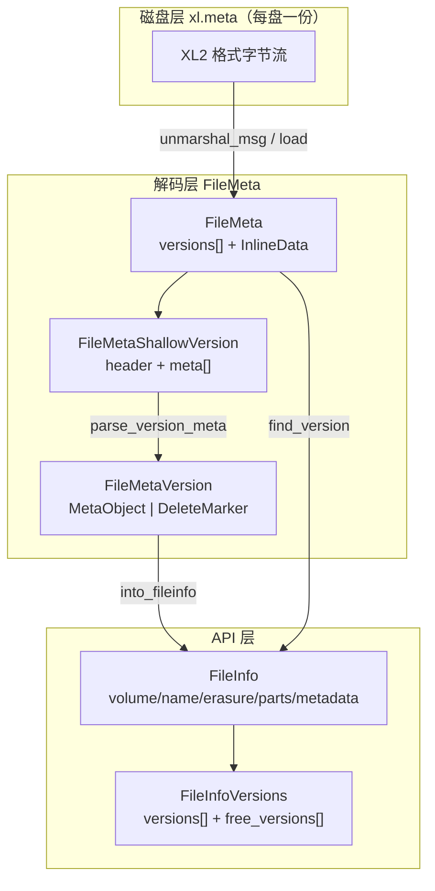
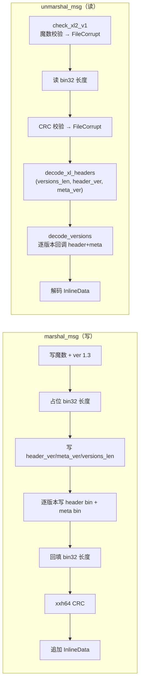

# RustFS 元数据设计结构

> 走读范围：`crates/filemeta`（xl.meta 磁盘格式、内存版本结构、metacache）、与 ECStore/ODC 的交叉关系。
> 配套总览见 [01-overall-framework.md](01-overall-framework.md)。

---

## 1. 元数据分层总览

RustFS 的对象元数据分三层表示，分别服务不同路径：

| 层 | 结构 | 用途 | 生命周期 |
|----|------|------|----------|
| **磁盘层** | `xl.meta`（XL2 格式） | 每盘一份，持久化对象全部版本 | 随对象写入/删除 |
| **解码层** | `FileMeta` → `FileMetaShallowVersion` → `FileMetaVersion` | 内存中完整/浅量版本视图 | 请求内 / 缓存 |
| **API 层** | `FileInfo` / `FileInfoVersions` | 上层与 RPC 使用的「解码后对象版本」 | 请求内 |



---

## 2. xl.meta 磁盘格式（XL2）

### 2.1 字节布局

每块盘上每个对象版本目录下有一个 `xl.meta`（另有 `xl.meta.bkp` 备份）。

```
偏移(示意)   内容
────────────────────────────────────────────────────────────
0x00         "XL2 "                      4B  魔数 XL_FILE_HEADER
0x04         major: u16 LE               2B  当前 = 1
0x06         minor: u16 LE               2B  当前 = 3
────────────────────────────────────────────────────────────
0x08         0xC6 + bin32 大端长度       5B  msgp bin32 前缀（载荷长度）
0x0D         ┌─ meta 载荷 ──────────────────────────────────┐
             │  header_ver: u8          当前 = 3             │
             │  meta_ver:   u8          当前 = 3             │
             │  versions_len: msgp int                      │
             │  重复 versions_len 次:                        │
             │    [ bin: FileMetaVersionHeader.marshal_msg ] │
             │    [ bin: FileMetaVersion.marshal_msg      ]  │
             └──────────────────────────────────────────────┘
             0xCE + u32 大端             5B  CRC = xxh64(meta)&0xFFFFFFFF
             InlineData 载荷             可选，小对象体
────────────────────────────────────────────────────────────
```

### 2.2 编解码流程



**关键安全约束**：

| 约束 | 位置 | 目的 |
|------|------|------|
| 魔数错误 → `FileCorrupt` | `check_xl2_v1` | 区分确定性损坏 vs 瞬时 IO 故障，供 heal 分类 |
| CRC 不匹配 → `FileCorrupt` | `is_indexed_meta` / `unmarshal_msg` | bitrot 检测，触发 heal |
| `versions_len > meta.len()` 拒绝 | `decode_versions` | 防按损坏长度预分配 OOM |
| `MAX_MSGP_ELEMENT_SIZE = 16 MiB` | `msgp_decode.rs` | 单元素上限，防损坏长度 |
| `prealloc_hint ≤ 4096` | `msgp_decode.rs` | 受控分配 |

---

## 3. 内存版本结构（核心）

### 3.1 结构层级图

```
FileMeta                                    ◄── 一份 xl.meta 的完整内存表示
├── versions: Vec<FileMetaShallowVersion>   ◄── 按 mod_time 降序（sorts_before）
│     │
│     ├── [0] FileMetaShallowVersion        ◄── 浅版本：列表/合并热路径
│     │     ├── header: FileMetaVersionHeader
│     │     │     ├── version_id: Option<Uuid>
│     │     │     ├── mod_time: Option<OffsetDateTime>   ◄── 排序主键
│     │     │     ├── signature: [u8; 4]                 ◄── body 指纹
│     │     │     ├── version_type: VersionType
│     │     │     ├── flags: u8                          ◄── Free/UsesDataDir/Inline
│     │     │     └── ec_n / ec_m: u8                    ◄── write_quorum 快推
│     │     └── meta: Vec<u8>                            ◄── FileMetaVersion 的 msgp 字节
│     │           │
│     │           └── FileMetaVersion        ◄── parse_version_meta() 解出
│     │                 ├── version_type: VersionType
│     │                 ├── object: Option<MetaObject>           ◄── V2 当前
│     │                 ├── legacy_object: Option<MetaObjectV1>  ◄── 旧格式
│     │                 ├── delete_marker: Option<MetaDeleteMarker>
│     │                 └── write_version: u64
│     │
│     ├── [1] FileMetaShallowVersion
│     └── ...
│
├── data: InlineData                         ◄── 小对象内联体
│     └── [ver:u8=1][ msgp map: version_key → body ]
│
└── meta_ver: u8                             ◄── XL_META_VERSION = 3
```

### 3.2 `FileMetaVersionHeader` — 快速路径头

7 元组 msgpack 数组，**不解 body 即可排序/quorum**：

| 字段 | 类型 | 作用 |
|------|------|------|
| `version_id` | `Option<Uuid>` | 版本 ID；None/nil = null 版本 |
| `mod_time` | `Option<OffsetDateTime>` | 修改时间（排序主键） |
| `signature` | `[u8; 4]` | body 内容签名（xxh64 折叠），检测部分写分歧 |
| `version_type` | `VersionType` | Object / Delete / Legacy / Invalid |
| `flags` | `u8` | bit0 FreeVersion, bit1 UsesDataDir, bit2 InlineData |
| `ec_n` | `u8` | 校验块数 |
| `ec_m` | `u8` | 数据块数 |

**排序谓词 `sorts_before`**（多盘一致「最新版本」的全序）：

```
mod_time 新者优先
  → version_type 小者优先
    → signature / version_id / flags 兜底
```

**`get_signature` 计算**：清零 per-disk 的 `erasure_index` → map 用 XOR 无关序哈希折叠 → 其余 body 走 xxh64 → 折成 4 字节。同内容不同盘一致，任何 body 分歧可检。

### 3.3 `MetaObject`（V2 对象体）— 字段一览

```
MetaObject {
    "ID"       version_id: Option<Uuid>,
    "DDir"     data_dir: Option<Uuid>,          ◄── 数据目录 UUID（write-unique 锚点）
    "EcAlgo"   erasure_algorithm: ErasureAlgo,
    "EcM"      erasure_m: usize,                ◄── 数据块
    "EcN"      erasure_n: usize,                ◄── 校验块
    "EcBSize"  erasure_block_size: usize,       ◄── 1 MiB
    "EcIndex"  erasure_index: usize,            ◄── 本盘序号
    "EcDist"   erasure_dist: Vec<u8>,           ◄── shard→disk 分布
    "CSumAlgo" bitrot_checksum_algo: ChecksumAlgo,
    "PartNums"    part_numbers: Vec<usize>,     ─┐
    "PartETags"   part_etags: Vec<String>,       │ 并行五元组
    "PartSizes"   part_sizes: Vec<usize>,        │ 描述分片
    "PartASizes"  part_actual_sizes: Vec<i64>,   │
    "PartIdx"     part_indices: Vec<Bytes>,     ─┘（压缩索引）
    "Size"     size: i64,
    "MTime"    mod_time: Option<OffsetDateTime>,
    "MetaSys"  meta_sys: HashMap<String, Vec<u8>>,   ◄── 内部元数据（双前缀）
    "MetaUsr"  meta_user: HashMap<String, String>,   ◄── 用户元数据
}
```

**内部元数据双前缀**（跨 MinIO 兼容）：`x-rustfs-internal-*` + `x-minio-internal-*`。

### 3.4 其他版本体

| 结构 | 用途 | 关键字段 |
|------|------|----------|
| `MetaDeleteMarker` | 删除标记版本 | `version_id / mod_time / meta_sys` |
| `MetaObjectV1` | Legacy（`format=="xl"`） | `Version/Format/Stat/Erasure/Meta/Parts/VersionID/DataDir` |
| `FileMetaVersion.write_version` | 写入序号 | 单调递增 |

---

## 4. `FileInfo` — API 层运行时视图

上层（ECStore / RPC / usecase）统一使用 `FileInfo`，由 `FileMetaVersion::into_fileinfo` 解出：

```
FileInfo {
    volume: String,  name: String,
    version_id: Option<Uuid>,
    is_latest / deleted / mark_deleted,
    data_dir: Option<Uuid>,              ◄── 对象体 shard 目录
    mod_time / size / mode,
    metadata: HashMap<String, String>,   ◄── MetaSys ∪ MetaUsr 合并
    parts: Vec<ObjectPartInfo>,          ◄── etag/size/index/checksums
    erasure: ErasureInfo,                ◄── 纠删几何
    data: Option<Bytes>,                 ◄── inline 对象体
    checksum: Option<Bytes>,
    transition_* / replication_*,        ◄── 分层/复制状态
}
```

```
ErasureInfo {
    algorithm: "rs-vandermonde",
    data_blocks / parity_blocks,
    block_size: 1 MiB,
    index: usize,                        ◄── 本盘序号
    distribution: Vec<usize>,            ◄── shard→disk 置换
    checksums: Vec<ChecksumInfo>,        ◄── 每分片 bitrot
}

ObjectPartInfo {
    etag / number / size / actual_size,
    mod_time / index(压缩索引) / checksums,
}
```

**脱敏**：`Debug` 手写 — `metadata` 走 `RedactedMetadata`，`data`/`checksum` 走 `ElidedBytes`，防止密钥材料/明文进日志。

---

## 5. InlineData — 小对象内联

小对象直接嵌在 `xl.meta` 尾部，避免独立数据文件：

```
InlineData(Vec<u8>)
  [ver: u8 = 1]
  [ msgp map: version_key(str) → body(bin) ]
       key: "null" | UUID 字符串
```

| 方法 | 作用 |
|------|------|
| `find(key)` | 按版本 key 取 body（零拷贝扫描） |
| `physical_data_dir` | 判定某版本是否仍占用 `data_dir`（inline/已转储未恢复的不算） |
| `shared_data_dir_count` | 删除版本时判断能否安全删数据目录 |
| `find_unshared_data_dir_for_version` | 定位可删的独占数据目录 |

---

## 6. metacache — 列表/扫描路径

### 6.1 结构

| 结构 | 作用 |
|------|------|
| `MetaCacheEntry` | `name` + 原始 `metadata: Vec<u8>` + 惰性 `cached: Option<FileMeta>` + `reusable` |
| `MetaCacheEntries(Vec<Option<MetaCacheEntry>>)` | **每盘一个槽位**；跨盘 quorum 合并 |
| `MetadataResolutionParams` | `dir_quorum / obj_quorum / write_quorum_slack / candidates` |
| `MetacacheWriter` / `MetacacheReader` | 流式编解码 |

**空 `metadata` 表示纯前缀目录项**（非对象）。

### 6.2 跨盘 quorum 合并

```
          盘0          盘1          盘2          盘3
        ┌──────┐    ┌──────┐    ┌──────┐    ┌──────┐
entry:  │ meta │    │ meta │    │ meta │    │ None │  ← 离线
        └──┬───┘    └──┬───┘    └──┬───┘    └──────┘
           │           │           │
           └───────────┼───────────┘
                       ▼
        MetaCacheEntries::resolve / resolve_with_write_quorum
                       │
                       ▼
              合并后的 FileMeta（多数一致版本）
```

- `write_quorum_slack`：因盘不可达放宽版本 quorum（合法提交的版本可能有 N 份元数据在不可读盘上）
- `resolve_union`：宽松合并（heal 路径）
- `discover_heal_candidates`：产出 heal 目标（上限 1024）

### 6.3 流式格式

```
MetacacheWriter:  [stream_ver u8][bool true + name str + metadata bin]...[bool false]
MetacacheReader:  增量解析（buf/offset/current），read_more 拒绝超限长度
```

---

## 7. 与其他子系统的交叉关系

```
                    xl.meta 磁盘字节
                          │
                          ▼
              FileMeta { versions[], InlineData }
                          │
          ┌───────────────┼───────────────┐
          ▼               ▼               ▼
   FileMetaShallow   InlineData      MetaCacheEntry
   Version{header}   (小对象体)      (列表缓存)
          │               │
          ▼               ▼
   FileMetaVersion    FileInfo.data
   {MetaObject}
          │
    ┌─────┴──────┬──────────────┐
    ▼            ▼              ▼
FileInfo    ObjectDataCache   ECStore
.metadata   Key.data_dir     ErasureInfo
            _u128            .distribution
```

| 交叉点 | 说明 |
|--------|------|
| **`FileInfo.data_dir` → ODC 缓存键** | 每次写入重新生成 `data_dir = Uuid::new_v4()`，保证覆盖写必换缓存键 |
| **`FileInfo.erasure.distribution` → shard→disk** | ECStore `shuffle_disks` 按此置换写盘顺序 |
| **`ErasureInfo.block_size` / `data_blocks` → 纠删码** | `calc_shard_size = ceil(block_size/data_blocks)` |
| **`MetaObject.meta_sys` → 加密/复制/分层** | SSE 密钥材料、replication state、transition 状态都存这里 |
| **`FileMetaVersionHeader.ec_n/ec_m` → write_quorum** | 不解 body 即可推 quorum：`data==parity ? data+1 : data` |

---

## 8. 内存管理与索引形态

> **本仓库元数据路径未使用 B+树。** 索引形态如下：

| 结构 | 形态 | 根 → 叶 |
|------|------|---------|
| **xl.meta 版本表** | 按 `sorts_before` 排序的 **线性 Vec** | `FileMeta.versions` → `FileMetaShallowVersion`；`find_version` 线性扫描 |
| **InlineData** | msgp map（顺序扫描） | `InlineData(Vec<u8>)` → key→body |
| **MetaCacheEntries** | 每盘槽位的 **Vec\<Option\>** | 槽位 = 盘；`resolve` 跨盘归并 |
| **Metacache 流** | 顺序流式 | Writer/Reader 增量 |
| **GetObjectMetadataCache**（ECStore） | moka 权重 LRU | key = 布局维度 → `Arc<GetObjectMetadataCacheEntry>`，TTL 2s + generation fence |

### 8.1 `FileMeta.versions` 排序不变量

```
versions[0]  ── sorts_before ──►  versions[1]  ──►  ...  ──►  versions[n]
   (最新)                                                        (最旧)
```

- 写入时 `sort_by_mod_time()` 重排
- `add_version_filemata` / `delete_version` 保持全序
- 多盘 merge 依赖此全序得到一致「最新版本」

### 8.2 `GetObjectMetadataCache`（ECStore `SetDisks`）

```
GetObjectMetadataCacheKey  ──►  Arc<GetObjectMetadataCacheEntry>
        │
        ├─ TTL 2s
        ├─ 容量 4096 条
        └─ generation fence 分片失效（invalidate_get_object_metadata_cache）
```

---

## 9. 关键代码位置速查

| 主题 | 位置 |
|------|------|
| `FileInfo` | `crates/filemeta/src/fileinfo.rs` |
| `FileMeta` / xl.meta 编解码 | `crates/filemeta/src/filemeta.rs`, `filemeta/codec.rs` |
| `FileMetaShallowVersion` / `FileMetaVersionHeader` | `crates/filemeta/src/filemeta/version.rs` |
| `MetaObject` / `MetaObjectV1` | `crates/filemeta/src/filemeta/version.rs` |
| `InlineData` | `crates/filemeta/src/filemeta_inline.rs` |
| msgp 安全解码 | `crates/filemeta/src/filemeta/msgp_decode.rs` |
| `MetaCacheEntry` / `MetaCacheEntries` | `crates/filemeta/src/metacache.rs` |
| 跨盘 listing 合并 | `crates/ecstore/src/cache_value/metacache_set.rs` |
| GET 元数据缓存 | `crates/ecstore/src/set_disk/mod.rs` |
| quorum 归并 | `crates/ecstore/src/set_disk/metadata.rs`, `set_disk/core/metadata_quorum.rs` |

---

## 10. 设计要点小结

1. **两阶段解码**：`FileMetaShallowVersion.header` 足以排序/quorum，body 按需 `parse_version_meta()` — 列表/扫描热路径少解码。
2. **CRC + signature 双校验**：文件级 xxh64 CRC 防 bitrot；版本级 4 字节 signature 防部分写分歧。
3. **write_quorum 内联在 header**：`ec_n/ec_m` 使 quorum 判断无需解 body。
4. **inline 小对象**：免独立数据文件；`data_dir` 仍生成以保持缓存键 write-unique。
5. **每盘一份 xl.meta + 跨盘 quorum merge**：不依赖中心元数据服务；`write_quorum_slack` 处理合法但不可达的副本。
6. **线性版本表而非 B+树**：对象版本数受 `DEFAULT_OBJECT_MAX_VERSIONS` 约束，线性扫描 + 排序足够；大目录列表走 walkdir 流式 + 跨盘 merge。

---

*相关文档：[01-overall-framework.md](01-overall-framework.md) · 后续专题：xl.meta 读写完整流程、quorum 合并算法、heal 元数据修复。*
